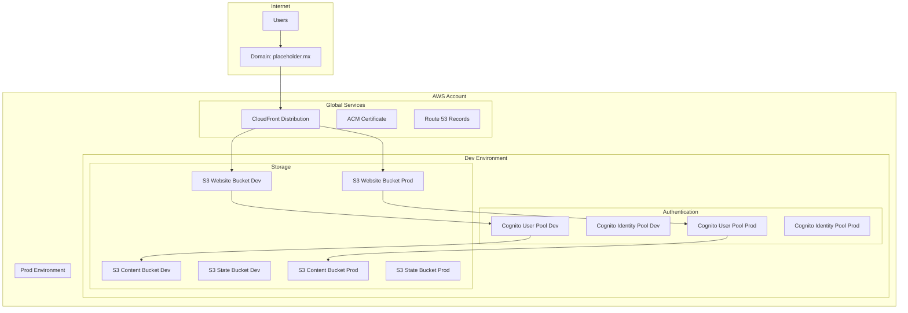

# Design Document

## Overview

This design outlines a comprehensive Infrastructure as Code (IaC) solution using Terraform and Terragrunt to deploy a scalable, cost-effective web application infrastructure on AWS. The architecture supports a Next.js frontend with AWS Cognito authentication, CloudFront distribution, and backend services for secure content delivery via S3 presigned URLs.

The solution emphasizes modularity, cost optimization, and environment separation while maintaining security best practices and operational simplicity.

## Architecture

### High-Level Architecture



### Environment Strategy

- **Development Environment**: Cost-optimized resources for testing and development
- **Production Environment**: Performance-optimized resources with enhanced security
- **Shared Resources**: CloudFront, Route 53, and ACM certificates shared across environments
- **Isolated State**: Separate Terraform state management per environment

## Components and Interfaces

### 1. Terragrunt Configuration Structure

```
├── terragrunt.hcl                 # Root configuration
├── environments/
│   ├── dev/
│   │   ├── terragrunt.hcl        # Dev environment config
│   │   ├── cognito/
│   │   │   └── terragrunt.hcl    # Cognito module config
│   │   ├── s3-website/
│   │   │   └── terragrunt.hcl    # Website S3 module config
│   │   ├── s3-content/
│   │   │   └── terragrunt.hcl    # Content S3 module config
│   │   └── cloudfront/
│   │       └── terragrunt.hcl    # CloudFront module config
│   └── prod/
│       ├── terragrunt.hcl        # Prod environment config
│       └── [same structure as dev]
└── modules/
    ├── cognito/
    ├── s3-website/
    ├── s3-content/
    └── cloudfront/
```

### 2. Custom Terraform Modules

#### S3 Website Module
- **Purpose**: Host static Next.js build artifacts
- **Features**: 
  - Static website hosting configuration
  - Public read access for website content
  - CloudFront origin access control
  - Cost-optimized storage classes
- **Inputs**: Environment, domain name, bucket naming prefix
- **Outputs**: Bucket ARN, website endpoint, bucket domain name

#### S3 Content Module
- **Purpose**: Store private content served via presigned URLs
- **Features**:
  - Private bucket with no public access
  - Server-side encryption (SSE-S3)
  - Lifecycle policies for cost optimization
  - Presigned URL generation capabilities
- **Inputs**: Environment, retention policies, encryption settings
- **Outputs**: Bucket ARN, bucket name for presigned URL generation

#### Cognito Module
- **Purpose**: User authentication and authorization
- **Features**:
  - User Pool with customizable policies
  - User Pool Client for Next.js integration
  - Identity Pool for AWS resource access
  - OAuth2/OIDC configuration
- **Inputs**: Environment, domain, callback URLs
- **Outputs**: User Pool ID, Client ID, Identity Pool ID

#### CloudFront Module
- **Purpose**: Global content distribution and SSL termination
- **Features**:
  - Custom domain with ACM certificate
  - Origin access control for S3
  - Caching behaviors optimized for Next.js
  - Security headers and CORS configuration
- **Inputs**: Domain name, S3 origins, certificate ARN
- **Outputs**: Distribution ID, domain name

### 3. State Management

#### Remote State Configuration
- **Backend**: S3 with DynamoDB locking
- **Structure**: Separate state files per environment and component
- **Encryption**: Server-side encryption enabled
- **Versioning**: Enabled for state recovery

#### State Bucket Design
```
terraform-state-{account-id}-{region}/
├── dev/
│   ├── cognito/terraform.tfstate
│   ├── s3-website/terraform.tfstate
│   ├── s3-content/terraform.tfstate
│   └── cloudfront/terraform.tfstate
└── prod/
    └── [same structure]
```

## Data Models

### 1. Environment Configuration

```hcl
# Environment-specific variables
locals {
  environment = "dev" # or "prod"
  
  # Cost optimization settings
  storage_class = local.environment == "prod" ? "STANDARD" : "STANDARD_IA"
  
  # Security settings
  mfa_required = local.environment == "prod" ? true : false
  
  # Scaling settings
  cloudfront_price_class = local.environment == "prod" ? "PriceClass_All" : "PriceClass_100"
}
```

### 2. Module Interface Contracts

```hcl
# S3 Website Module Variables
variable "environment" {
  description = "Environment name (dev/prod)"
  type        = string
}

variable "domain_name" {
  description = "Domain name for the website"
  type        = string
}

variable "enable_versioning" {
  description = "Enable S3 versioning"
  type        = bool
  default     = false
}

# Cognito Module Variables
variable "password_policy" {
  description = "Password policy configuration"
  type = object({
    minimum_length    = number
    require_lowercase = bool
    require_numbers   = bool
    require_symbols   = bool
    require_uppercase = bool
  })
}
```

### 3. Resource Naming Convention

```hcl
# Naming convention: {service}-{environment}-{purpose}-{random_suffix}
locals {
  naming_prefix = "${var.project_name}-${var.environment}"
  
  bucket_names = {
    website = "${local.naming_prefix}-website-${random_id.suffix.hex}"
    content = "${local.naming_prefix}-content-${random_id.suffix.hex}"
    state   = "${local.naming_prefix}-tfstate-${random_id.suffix.hex}"
  }
}
```

## Error Handling

### 1. Terraform State Management
- **State Locking**: DynamoDB table prevents concurrent modifications
- **State Backup**: S3 versioning enables state recovery
- **State Validation**: Pre-commit hooks validate Terraform syntax

### 2. Deployment Failures
- **Rollback Strategy**: Terragrunt dependency management ensures safe rollbacks
- **Partial Failures**: Component isolation prevents cascading failures
- **Retry Logic**: GitHub Actions implement exponential backoff for transient failures

### 3. Resource Conflicts
- **Unique Naming**: Random suffixes prevent resource name conflicts
- **Dependency Management**: Explicit dependencies prevent race conditions
- **Resource Tagging**: Consistent tagging enables resource identification

### 4. Security Failures
- **Access Validation**: IAM policies follow least privilege principle
- **Encryption Verification**: All data at rest and in transit encrypted
- **Certificate Management**: Automated ACM certificate renewal

## Testing Strategy

### 1. Infrastructure Validation

#### Static Analysis
- **Terraform Validate**: Syntax and configuration validation
- **TFLint**: Best practices and security rule enforcement
- **Checkov**: Security and compliance scanning
- **TFSec**: Security-focused static analysis

#### Integration Testing
- **Terratest**: Automated infrastructure testing framework
- **Test Scenarios**:
  - Resource creation and configuration
  - Cross-environment isolation
  - Security policy validation
  - Cost optimization verification

### 2. Deployment Testing

#### Smoke Tests
- **Website Accessibility**: Verify CloudFront serves content
- **Authentication Flow**: Test Cognito user registration/login
- **Presigned URLs**: Validate secure content access
- **SSL Certificate**: Verify HTTPS functionality

#### Performance Tests
- **CloudFront Caching**: Verify cache hit ratios
- **S3 Response Times**: Measure presigned URL generation
- **Cognito Latency**: Test authentication response times

### 3. Security Testing

#### Access Control Tests
- **S3 Bucket Policies**: Verify private content remains private
- **Cognito Permissions**: Test user access boundaries
- **CloudFront Security**: Validate security headers

#### Compliance Tests
- **Encryption Verification**: Ensure all data encrypted
- **Access Logging**: Verify audit trail completeness
- **Backup Validation**: Test state recovery procedures

### 4. Cost Optimization Testing

#### Resource Utilization
- **Storage Class Optimization**: Verify lifecycle policies
- **CloudFront Efficiency**: Monitor cache performance
- **Unused Resource Detection**: Identify optimization opportunities

## Implementation Considerations

### 1. Cost Optimization Strategies

#### Development Environment
- **S3 Storage**: Standard-IA for reduced costs
- **CloudFront**: PriceClass_100 for regional distribution
- **Cognito**: Basic user pool features
- **Lifecycle Policies**: Aggressive cleanup of old versions

#### Production Environment
- **S3 Storage**: Standard for performance
- **CloudFront**: PriceClass_All for global distribution
- **Cognito**: Advanced security features enabled
- **Lifecycle Policies**: Balanced retention and cost

### 2. Security Best Practices

#### Data Protection
- **Encryption**: AES-256 for S3, TLS 1.2+ for transit
- **Access Control**: Principle of least privilege
- **Presigned URLs**: Short expiration times (15 minutes default)
- **CORS Configuration**: Restrictive origin policies

#### Authentication Security
- **Password Policies**: Strong requirements for production
- **MFA**: Optional for dev, required for prod
- **Session Management**: Secure token handling
- **OAuth Scopes**: Minimal required permissions

### 3. Operational Excellence

#### Monitoring and Alerting
- **CloudWatch Metrics**: Track key performance indicators
- **Cost Alerts**: Monitor spending thresholds
- **Security Alerts**: Detect unusual access patterns
- **Availability Monitoring**: Track service uptime

#### Backup and Recovery
- **State Backup**: Automated S3 versioning
- **Configuration Backup**: Git-based version control
- **Disaster Recovery**: Cross-region state replication
- **Recovery Testing**: Regular restore procedures

### 4. Scalability Considerations

#### Horizontal Scaling
- **Multi-Region**: CloudFront global distribution
- **Load Distribution**: S3 request rate optimization
- **User Scaling**: Cognito automatic scaling
- **Content Scaling**: S3 unlimited storage capacity

#### Performance Optimization
- **Caching Strategy**: Aggressive CloudFront caching
- **Content Optimization**: Gzip compression enabled
- **DNS Optimization**: Route 53 health checks
- **Connection Optimization**: HTTP/2 support