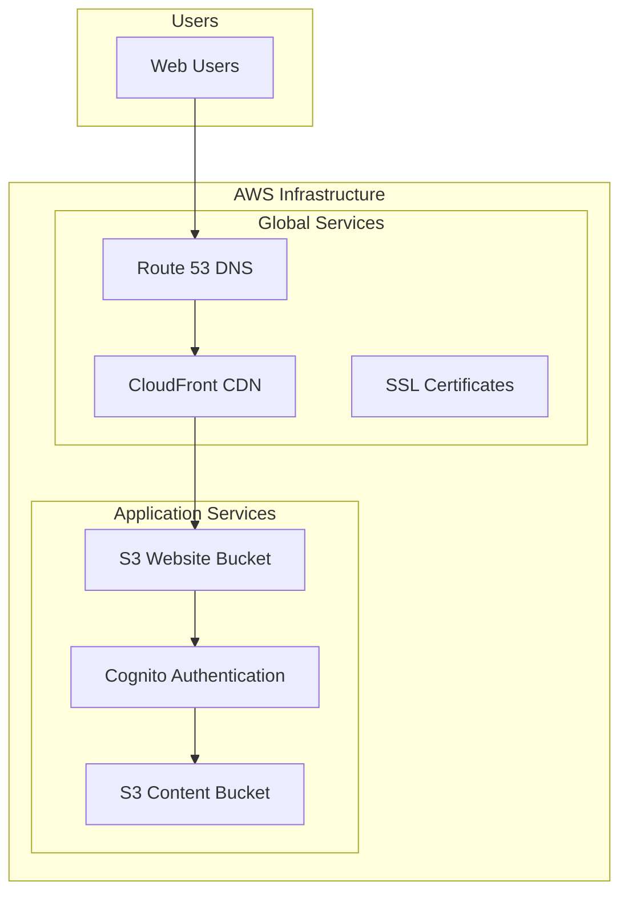
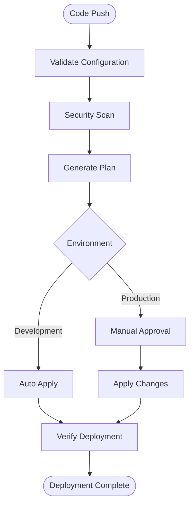

# 🚀 Terraform Next.js Infrastructure

Simple, pure Terraform Infrastructure as Code for Next.js applications on AWS. Deploy with confidence using environment-specific configuration files and streamlined deployment scripts.

## ✨ What You Get

- **🌐 Static Website Hosting**: S3 + CloudFront for Next.js apps
- **🔐 User Authentication**: AWS Cognito for secure login
- **📦 Content Delivery**: Global CDN with custom domains
- **🔒 Secure Content**: Private S3 with presigned URL access
- **🏗️ Multi-Environment**: Separate dev and prod environments with .env configuration
- **💰 Cost Optimized**: ~$15-25/month (dev), ~$35-55/month (prod)
- **📊 Monitoring**: Essential monitoring for ~$0.60-6.80/month
- **⚡ Pure Terraform**: Simplified deployment without Terragrunt complexity

## 📁 Project Structure

```
├── bootstrap/                 # Bootstrap infrastructure for state management
│   ├── main.tf               # S3 bucket and DynamoDB table for Terraform state
│   ├── variables.tf          # Bootstrap variables
│   ├── outputs.tf            # Bootstrap outputs
│   ├── bootstrap.sh          # Bootstrap script (Linux/macOS)
│   ├── bootstrap.ps1         # Bootstrap script (Windows)
│   └── README.md             # Bootstrap documentation
├── environments/             # Environment-specific Terraform configurations
│   ├── dev/                  # Development environment
│   │   ├── main.tf           # Main Terraform configuration
│   │   ├── variables.tf      # Variable definitions
│   │   ├── outputs.tf        # Output values
│   │   ├── backend.tf        # Backend configuration
│   │   └── terraform.tfvars  # Auto-generated from .env files
│   └── prod/                 # Production environment (same structure)
├── modules/                  # Custom Terraform modules
│   ├── cognito/              # Cognito authentication module
│   ├── s3-website/           # S3 static website hosting module
│   ├── s3-content/           # S3 private content storage module
│   ├── cloudfront/           # CloudFront distribution module
│   ├── route53-acm/          # Route 53 and ACM certificate module
│   └── monitoring/           # CloudWatch monitoring and alerting module
├── config/                   # Environment configuration files
│   ├── common.env            # Shared environment variables
│   ├── dev.env               # Development-specific variables
│   └── prod.env              # Production-specific variables
├── scripts/                  # Deployment utilities
│   ├── deploy.sh             # Main deployment script
│   └── load-env.sh           # Environment loading utility
├── .gitignore                # Git ignore patterns
└── README.md                 # This file
```

## 🚀 Quick Start

### 1. Prerequisites
- AWS CLI configured (`aws configure`)
- Terraform (>= 1.0)
- Bash shell (Linux/macOS) or Git Bash (Windows)

### 2. Bootstrap (One-time setup)
```bash
# Create state management infrastructure
cd bootstrap
./bootstrap.sh  # or bootstrap.ps1 on Windows
```

### 3. Configure Environment Variables
Edit the environment configuration files in the `config/` directory:
- `config/common.env` - Shared variables across environments
- `config/dev.env` - Development-specific configuration
- `config/prod.env` - Production-specific configuration

### 4. Deploy to Development
```bash
# Deploy development environment
./scripts/deploy.sh dev plan    # Review changes
./scripts/deploy.sh dev apply   # Apply changes
```

### 5. Deploy to Production
```bash
# Deploy production environment
./scripts/deploy.sh prod plan   # Review changes
./scripts/deploy.sh prod apply  # Apply changes (requires confirmation)
```

## 🎯 That's It!
Your infrastructure is now deployed using pure Terraform with environment-specific configuration files!

> 📖 **New to this project?** Check out the [Getting Started Guide](GETTING_STARTED.md) for a detailed walkthrough!

## 🔧 Pure Terraform Approach

This project has been simplified to use **pure Terraform** instead of Terragrunt, making it easier to understand and deploy. Here's what changed:

### Key Benefits
- **Simplified Architecture**: No Terragrunt complexity or nested configurations
- **Environment Variables**: Clear `.env` files for environment-specific settings
- **Direct Terraform**: Standard Terraform commands and workflows
- **Easy Configuration**: Edit `.env` files instead of complex HCL configurations
- **Better Debugging**: Clearer error messages and troubleshooting

### How It Works
1. **Environment Configuration**: Variables are defined in `config/*.env` files
2. **Automatic Generation**: Deployment script generates `terraform.tfvars` from `.env` files
3. **Standard Terraform**: Uses standard Terraform commands (`init`, `plan`, `apply`)
4. **Environment Isolation**: Separate directories for dev and prod with their own state

### Fresh Deployment Setup

Since this is a fresh deployment (no existing AWS resources), follow these steps:

#### 1. Initial Setup
```bash
# Clone the repository
git clone <repository-url>
cd terraform-nextjs-infrastructure

# Configure AWS credentials
aws configure
```

#### 2. Bootstrap State Management
```bash
# Create S3 bucket and DynamoDB table for Terraform state
cd bootstrap
./bootstrap.sh  # Linux/macOS
# or
.\bootstrap.ps1  # Windows PowerShell
```

#### 3. Configure Your Environment
Edit the configuration files to match your setup:

```bash
# Edit common settings
nano config/common.env

# Edit development settings
nano config/dev.env

# Edit production settings  
nano config/prod.env
```

**Important**: Update these key variables:
- `DOMAIN_NAME`: Your actual domain name
- `ROOT_DOMAIN`: Your root domain
- `S3_CONTENT_BUCKET_PREFIX`: Unique prefix for your S3 buckets
- `CORS_ALLOW_ORIGINS`: Your application URLs

#### 4. Deploy Development Environment
```bash
# Plan the deployment (review changes)
./scripts/deploy.sh dev plan

# Apply the deployment
./scripts/deploy.sh dev apply
```

#### 5. Deploy Production Environment
```bash
# Plan the deployment (review changes)
./scripts/deploy.sh prod plan

# Apply the deployment (requires confirmation)
./scripts/deploy.sh prod apply
```

### Environment Variable Reference

#### Required Variables (must be customized)
- `DOMAIN_NAME`: Primary domain for your application
- `ROOT_DOMAIN`: Root domain for DNS management
- `S3_CONTENT_BUCKET_PREFIX`: Unique prefix for S3 buckets
- `CORS_ALLOW_ORIGINS`: Allowed origins for CORS

#### Optional Variables (have sensible defaults)
- `COGNITO_MIN_PASSWORD_LENGTH`: Password complexity requirements
- `CLOUDFRONT_PRICE_CLASS`: CloudFront distribution scope
- `S3_ENABLE_VERSIONING`: S3 object versioning
- `ROUTE53_CREATE_HOSTED_ZONE`: Whether to create Route53 hosted zone

### Validation and Safety
The deployment script includes comprehensive validation:
- **Environment Variable Validation**: Checks for required variables and formats
- **AWS Credentials**: Validates AWS access and permissions
- **Terraform Prerequisites**: Ensures Terraform is installed and configured
- **Environment Consistency**: Validates configuration matches environment
- **Production Safety**: Requires explicit confirmation for production deployments

### Migration from Terragrunt (if applicable)

If you're migrating from a previous Terragrunt-based version:

1. **Backup Existing State**: Ensure your Terraform state is safely backed up
2. **Review Configuration**: Compare your existing Terragrunt variables with the new `.env` files
3. **Update Variables**: Transfer your configuration to the appropriate `.env` files
4. **Test in Development**: Deploy to development environment first to validate the migration
5. **Remove Terragrunt Files**: After successful migration, remove old `terragrunt.hcl` files

**Note**: The state management (S3 bucket and DynamoDB table) remains the same, so your existing infrastructure state is preserved.

## ⚙️ Environment Configuration

### Configuration Files
The project uses `.env` files for environment-specific configuration:

- **`config/common.env`**: Shared variables across all environments
- **`config/dev.env`**: Development-specific settings (relaxed security, cost-optimized)
- **`config/prod.env`**: Production-specific settings (enhanced security, performance-optimized)

### Key Configuration Areas

#### Development Environment
- Relaxed password policies (8 characters minimum)
- Regional CloudFront distribution (cost-optimized)
- S3 versioning disabled
- CORS allows localhost for local development
- Optional MFA for easier development

#### Production Environment
- Strict password policies (12 characters minimum, symbols required)
- Global CloudFront distribution
- S3 versioning enabled
- Restricted CORS origins
- MFA enforced for enhanced security

### Customizing Configuration
1. Edit the appropriate `.env` file in the `config/` directory
2. Run the deployment script to apply changes
3. The script automatically generates `terraform.tfvars` from your `.env` files

## 🛠️ Deployment Commands

### Basic Deployment
```bash
# Plan changes (recommended first step)
./scripts/deploy.sh [environment] plan

# Apply changes
./scripts/deploy.sh [environment] apply

# Get infrastructure outputs
./scripts/deploy.sh [environment] output

# Destroy infrastructure (careful!)
./scripts/deploy.sh [environment] destroy
```

### Examples
```bash
# Development workflow
./scripts/deploy.sh dev plan     # Review development changes
./scripts/deploy.sh dev apply    # Deploy to development

# Production workflow
./scripts/deploy.sh prod plan    # Review production changes
./scripts/deploy.sh prod apply   # Deploy to production (requires confirmation)

# Get outputs
./scripts/deploy.sh dev output   # Show development outputs
./scripts/deploy.sh prod output  # Show production outputs

# Initialize only (useful for troubleshooting)
./scripts/deploy.sh dev init-only
```

### Advanced Operations
```bash
# Refresh state
./scripts/deploy.sh dev refresh

# Validate configuration
cd environments/dev && terraform validate

# Format Terraform files
terraform fmt -recursive
```

## 🏛️ Infrastructure Components

### Core Services

- **S3 Buckets**: Static website hosting and private content storage
- **CloudFront**: Global CDN with custom domain support
- **Cognito**: User authentication and authorization
- **Route 53**: DNS management and domain routing
- **ACM**: SSL/TLS certificate management

### Architecture Overview



For comprehensive architectural diagrams and system design:
🏗️ **[Architecture Documentation](docs/ARCHITECTURE.md)**

### Security Features

- **Data Protection**: Server-side encryption for all S3 buckets
- **Access Control**: Private content access via presigned URLs
- **Authentication**: OAuth2/OIDC authentication flows with Cognito
- **Network Security**: HTTPS-only with security headers
- **Monitoring**: CloudTrail logging and access monitoring

### Cost Optimization

- **Environment Sizing**: Appropriate resource sizing for dev vs prod
- **Storage Optimization**: S3 lifecycle policies for cost reduction
- **CDN Efficiency**: CloudFront caching strategies
- **Billing Optimization**: Pay-per-request DynamoDB billing
- **Geographic Optimization**: Regional vs global CloudFront distributions

## 💰 Cost Estimation (Low Traffic)

### Development Environment (~$15-25/month)
- **S3 Storage**: ~$1-3/month (5-15GB storage, minimal requests)
- **CloudFront**: ~$1-2/month (regional distribution, low data transfer)
- **Route 53**: ~$0.50/month (hosted zone)
- **ACM**: Free (AWS managed certificates)
- **Cognito**: ~$0-1/month (up to 50,000 MAU free tier)
- **DynamoDB**: ~$0.25/month (on-demand billing, minimal operations)
- **Monitoring**: ~$0.60/month (essential CloudWatch metrics)
- **Miscellaneous**: ~$12-18/month (NAT Gateway, data transfer, misc services)

### Production Environment (~$35-55/month)
- **S3 Storage**: ~$3-8/month (20-50GB storage, moderate requests)
- **CloudFront**: ~$8-15/month (global distribution, moderate data transfer)
- **Route 53**: ~$0.50/month (hosted zone)
- **ACM**: Free (AWS managed certificates)
- **Cognito**: ~$0-5/month (depending on active users)
- **DynamoDB**: ~$1-2/month (on-demand billing, moderate operations)
- **Monitoring**: ~$6.80/month (comprehensive CloudWatch metrics and alarms)
- **Miscellaneous**: ~$15-25/month (enhanced security, backup, data transfer)

### Traffic Assumptions (Low Traffic)
- **Monthly Visitors**: 100-500 unique users
- **Page Views**: 1,000-5,000 per month
- **Content Storage**: 5-50GB (images, videos, documents)
- **Data Transfer**: 10-100GB per month
- **API Requests**: 10,000-50,000 per month

### Cost Optimization Tips
- Use S3 Intelligent Tiering for automatic cost optimization
- Enable CloudFront compression to reduce data transfer costs
- Implement proper caching strategies to minimize origin requests
- Monitor usage with AWS Cost Explorer and set up billing alerts
- Consider Reserved Instances for predictable workloads (not applicable for this serverless architecture)

*Note: Costs may vary based on actual usage patterns, AWS region, and specific configuration choices. These estimates are based on US East (N. Virginia) region pricing as of 2024.*

## 🌍 Environment Management

### Development Environment
- Cost-optimized resources
- Relaxed security policies for development
- Regional CloudFront distribution
- Standard-IA storage classes

### Production Environment
- Performance-optimized resources
- Enhanced security features
- Global CloudFront distribution
- Standard storage classes with lifecycle policies

## 📋 Requirements Addressed

This infrastructure addresses the following key requirements:

1. **Multi-Environment Support** (Requirements 1.1, 1.4)
   - Separate dev and prod environments
   - Terragrunt-based selective deployment
   - S3-based state management within the same AWS account

2. **Static Website Hosting** (Requirements 2.1-2.4)
   - S3 static website hosting for Next.js builds
   - CloudFront CDN for global performance
   - Custom domain support with SSL certificates
   - Cache invalidation capabilities

3. **User Authentication** (Requirements 3.1-3.4)
   - AWS Cognito User Pool integration
   - OAuth2/OIDC support for frontend applications
   - Secure token-based authentication

4. **Secure Content Delivery** (Requirements 4.1-4.4)
   - Private S3 buckets for content storage
   - Presigned URL generation with access controls
   - Server-side encryption and security policies

5. **Modular Architecture** (Requirement 5.1)
   - Custom Terraform modules for each service
   - Reusable components with proper documentation
   - Separation of concerns between services

## � DDeployment Flow

### Automated Deployment Process



### Development Workflow

1. **Local Development**
   ```bash
   # Plan changes locally
   ./scripts/deploy.sh dev plan
   
   # Apply changes
   ./scripts/deploy.sh dev apply
   ```

2. **Environment-Specific Configuration**
   ```bash
   # Edit environment variables
   nano config/dev.env     # Development settings
   nano config/prod.env    # Production settings
   
   # Deploy with new configuration
   ./scripts/deploy.sh dev apply
   ```

3. **Direct Terraform Commands** (if needed)
   ```bash
   # Navigate to environment directory
   cd environments/dev
   
   # Standard Terraform workflow
   terraform init
   terraform plan
   terraform apply
   ```

For detailed deployment procedures:
🚀 **[Development Deployment Guide](docs/DEVELOPMENT_DEPLOYMENT.md)**

### Module Development

1. **Create/Modify Modules**: Work in the `modules/` directory
2. **Validate in Development**: Use dev environment for testing changes
3. **Update Documentation**: Keep module READMEs current
4. **Production Deployment**: Deploy to production using deployment scripts

For comprehensive module usage examples and configuration:
🔧 **[Module Usage Guide](docs/MODULE_USAGE.md)**

## 📊 Monitoring and Maintenance

### Infrastructure Monitoring
- **State Management**: S3 with versioning and DynamoDB locking
- **Cost Monitoring**: Automated budgets, alerts, and optimization recommendations
- **Security Monitoring**: Continuous scanning with Checkov and custom policies
- **Performance Monitoring**: CloudFront metrics, cache hit ratios, and response times

### Cost Optimization
- **Environment-Specific**: Different optimization strategies for dev vs prod
- **Automated Lifecycle**: S3 storage class transitions and cleanup policies
- **Monitoring Dashboards**: Real-time cost tracking and anomaly detection
- **Budget Alerts**: Proactive notifications for cost thresholds

For detailed cost optimization strategies and monitoring procedures:
💰 **[Cost Optimization Guide](docs/COST_OPTIMIZATION.md)**

### Security Features
- **Encryption**: All data encrypted at rest (S3, DynamoDB) and in transit (TLS 1.2+)
- **Access Control**: IAM policies following least privilege principle
- **Authentication**: AWS Cognito with MFA and strong password policies
- **Monitoring**: CloudTrail logging and security event monitoring
- **Compliance**: Automated security scanning and exception management

For comprehensive security documentation:
🔒 **[Security Scanning Guide](docs/SECURITY_SCANNING.md)**

## 🆘 Troubleshooting

### Quick Fixes

1. **State locking errors**
   - Check DynamoDB table permissions
   - Verify state bucket access
   - Use `terraform force-unlock <LOCK_ID>` if necessary

2. **Environment variable errors**
   - Verify `.env` files exist in `config/` directory
   - Check for missing required variables
   - Validate variable formats (domains, booleans, etc.)

3. **AWS permission errors**
   - Check IAM policies and permissions
   - Verify AWS CLI configuration: `aws sts get-caller-identity`
   - Ensure AWS credentials are properly configured

4. **CloudFront deployment issues**
   - Certificate validation can take 5-30 minutes
   - Check Route53 DNS validation records
   - Verify domain ownership

5. **Terraform initialization issues**
   - Remove `.terraform` directory and re-run `terraform init`
   - Check backend configuration in `backend.tf`
   - Verify S3 bucket and DynamoDB table exist (run bootstrap if needed)

### Comprehensive Troubleshooting

For detailed troubleshooting procedures, common issues, and solutions:
📖 **[Complete Troubleshooting Guide](docs/TROUBLESHOOTING.md)**

### Getting Help

1. Check the [Troubleshooting Guide](docs/TROUBLESHOOTING.md) for detailed solutions
2. Review [Module Usage Examples](docs/MODULE_USAGE.md) for configuration help
3. Check the bootstrap README for initial setup issues
4. Review deployment script logs for detailed error messages
5. Validate Terraform syntax with `terraform validate`
6. Check environment variable configuration in `config/*.env` files

## 🤝 Contributing

1. Create feature branches for changes
2. Validate changes in dev environment first
3. Update documentation for any new features
4. Follow Terraform and Terragrunt best practices

## 📄 License

This project is licensed under the MIT License - see the LICENSE file for details.

## 🔒 Security Scanning

This project includes comprehensive security scanning using Checkov with:

### Features
- **Custom Security Policies**: Organization-specific security requirements
- **Automated Scanning**: Integrated into CI/CD workflows
- **Exception Management**: Approved exceptions with justifications and review dates
- **Multiple Output Formats**: CLI, SARIF, JSON, and JUnit reports
- **GitHub Integration**: Security findings uploaded to GitHub Security tab

### Quick Commands
```bash
# Run security scan on all environments
checkov --config-file .checkov.yml --directory .

# Run security scan on specific environment
checkov --config-file .checkov.yml --directory environments/dev
checkov --config-file .checkov.yml --directory environments/prod

# Run security scan on modules
checkov --config-file .checkov.yml --directory modules
```

### Documentation
- [Security Scanning Guide](docs/SECURITY_SCANNING.md) - Comprehensive security scanning documentation
- [Custom Policies](.checkov/custom_policies/) - Organization-specific security policies
- [Security Baseline](.checkov.baseline) - Approved security exceptions

## 📚 Documentation

### Project Documentation
- 🏗️ **[Architecture Guide](docs/ARCHITECTURE.md)** - Comprehensive architectural diagrams and system design
- 🔧 **[Module Usage Guide](docs/MODULE_USAGE.md)** - Detailed examples and configuration options for all modules
- 🆘 **[Troubleshooting Guide](docs/TROUBLESHOOTING.md)** - Common issues, solutions, and debugging procedures
- 💰 **[Cost Optimization Guide](docs/COST_OPTIMIZATION.md)** - Cost optimization strategies and monitoring procedures
- 🔒 **[Security Scanning Guide](docs/SECURITY_SCANNING.md)** - Comprehensive security scanning with Checkov
- 🚀 **[Development Deployment Guide](docs/DEVELOPMENT_DEPLOYMENT.md)** - Automated deployment workflows and procedures

### External Documentation
- [Terraform Documentation](https://www.terraform.io/docs)
- [Terragrunt Documentation](https://terragrunt.gruntwork.io/docs)
- [AWS Provider Documentation](https://registry.terraform.io/providers/hashicorp/aws/latest/docs)
- [Next.js Deployment Guide](https://nextjs.org/docs/deployment)
- [Checkov Documentation](https://www.checkov.io/)