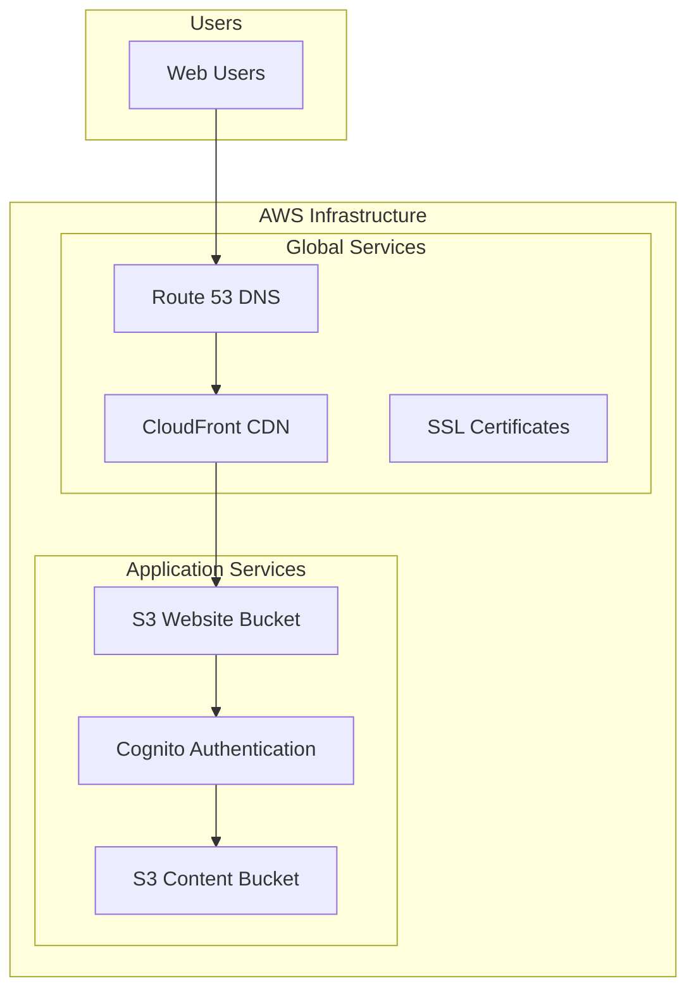

# Terraform Next.js Infrastructure

A comprehensive Infrastructure as Code (IaC) solution using Terraform and Terragrunt to deploy a scalable, cost-effective web application infrastructure on AWS for Next.js applications.

## 🏗️ Architecture Overview

This infrastructure supports:
- **Next.js Frontend**: Static website hosting with S3 and CloudFront
- **User Authentication**: AWS Cognito for secure user management
- **Content Delivery**: Global CDN with custom domain support
- **Secure Content**: Private S3 buckets with presigned URL access
- **Multi-Environment**: Separate dev and prod environments
- **Cost Optimization**: Environment-appropriate resource sizing
- **Ultra-Low Cost Monitoring**: Essential monitoring for ~$0.60/month (dev), ~$6.80/month (prod)
- **Cost-Effective**: Estimated monthly costs for low traffic: ~$15-25 (dev), ~$35-55 (prod)

## 📁 Project Structure

```
├── bootstrap/                 # Bootstrap infrastructure for state management
│   ├── main.tf               # S3 bucket and DynamoDB table for Terraform state
│   ├── variables.tf          # Bootstrap variables
│   ├── outputs.tf            # Bootstrap outputs
│   ├── bootstrap.sh          # Bootstrap script (Linux/macOS)
│   ├── bootstrap.ps1         # Bootstrap script (Windows)
│   └── README.md             # Bootstrap documentation
├── environments/             # Environment-specific configurations
│   ├── dev/                  # Development environment
│   └── prod/                 # Production environment
├── modules/                  # Custom Terraform modules
│   ├── cognito/              # Cognito authentication module
│   ├── s3-website/           # S3 static website hosting module
│   ├── s3-content/           # S3 private content storage module
│   ├── cloudfront/           # CloudFront distribution module
│   ├── route53-acm/          # Route 53 and ACM certificate module
│   └── monitoring/           # CloudWatch monitoring and alerting module
├── terragrunt.hcl            # Root Terragrunt configuration
├── .gitignore                # Git ignore patterns
└── README.md                 # This file
```

## 🚀 Quick Start

### Prerequisites

1. **AWS CLI** configured with appropriate credentials
2. **Terraform** (>= 1.0)
3. **Terragrunt** (>= 0.45.0)
4. **Git** for version control

### Installation

1. **Clone the repository**
   ```bash
   git clone <repository-url>
   cd terraform-nextjs-infrastructure
   ```

2. **Bootstrap the state infrastructure**
   ```bash
   cd bootstrap
   ./bootstrap.sh  # Linux/macOS
   # or
   .\bootstrap.ps1  # Windows PowerShell
   ```

3. **Deploy an environment**
   ```bash
   cd environments/dev
   terragrunt run-all plan    # Review changes
   terragrunt run-all apply   # Deploy infrastructure
   ```

## 🏛️ Infrastructure Components

### Core Services

- **S3 Buckets**: Static website hosting and private content storage
- **CloudFront**: Global CDN with custom domain support
- **Cognito**: User authentication and authorization
- **Route 53**: DNS management and domain routing
- **ACM**: SSL/TLS certificate management

### Architecture Overview



For comprehensive architectural diagrams and system design:
🏗️ **[Architecture Documentation](docs/ARCHITECTURE.md)**

### Security Features

- **Data Protection**: Server-side encryption for all S3 buckets
- **Access Control**: Private content access via presigned URLs
- **Authentication**: OAuth2/OIDC authentication flows with Cognito
- **Network Security**: HTTPS-only with security headers
- **Monitoring**: CloudTrail logging and access monitoring

### Cost Optimization

- **Environment Sizing**: Appropriate resource sizing for dev vs prod
- **Storage Optimization**: S3 lifecycle policies for cost reduction
- **CDN Efficiency**: CloudFront caching strategies
- **Billing Optimization**: Pay-per-request DynamoDB billing
- **Geographic Optimization**: Regional vs global CloudFront distributions

## 💰 Cost Estimation (Low Traffic)

### Development Environment (~$15-25/month)
- **S3 Storage**: ~$1-3/month (5-15GB storage, minimal requests)
- **CloudFront**: ~$1-2/month (regional distribution, low data transfer)
- **Route 53**: ~$0.50/month (hosted zone)
- **ACM**: Free (AWS managed certificates)
- **Cognito**: ~$0-1/month (up to 50,000 MAU free tier)
- **DynamoDB**: ~$0.25/month (on-demand billing, minimal operations)
- **Monitoring**: ~$0.60/month (essential CloudWatch metrics)
- **Miscellaneous**: ~$12-18/month (NAT Gateway, data transfer, misc services)

### Production Environment (~$35-55/month)
- **S3 Storage**: ~$3-8/month (20-50GB storage, moderate requests)
- **CloudFront**: ~$8-15/month (global distribution, moderate data transfer)
- **Route 53**: ~$0.50/month (hosted zone)
- **ACM**: Free (AWS managed certificates)
- **Cognito**: ~$0-5/month (depending on active users)
- **DynamoDB**: ~$1-2/month (on-demand billing, moderate operations)
- **Monitoring**: ~$6.80/month (comprehensive CloudWatch metrics and alarms)
- **Miscellaneous**: ~$15-25/month (enhanced security, backup, data transfer)

### Traffic Assumptions (Low Traffic)
- **Monthly Visitors**: 100-500 unique users
- **Page Views**: 1,000-5,000 per month
- **Content Storage**: 5-50GB (images, videos, documents)
- **Data Transfer**: 10-100GB per month
- **API Requests**: 10,000-50,000 per month

### Cost Optimization Tips
- Use S3 Intelligent Tiering for automatic cost optimization
- Enable CloudFront compression to reduce data transfer costs
- Implement proper caching strategies to minimize origin requests
- Monitor usage with AWS Cost Explorer and set up billing alerts
- Consider Reserved Instances for predictable workloads (not applicable for this serverless architecture)

*Note: Costs may vary based on actual usage patterns, AWS region, and specific configuration choices. These estimates are based on US East (N. Virginia) region pricing as of 2024.*

## 🌍 Environment Management

### Development Environment
- Cost-optimized resources
- Relaxed security policies for development
- Regional CloudFront distribution
- Standard-IA storage classes

### Production Environment
- Performance-optimized resources
- Enhanced security features
- Global CloudFront distribution
- Standard storage classes with lifecycle policies

## 📋 Requirements Addressed

This infrastructure addresses the following key requirements:

1. **Multi-Environment Support** (Requirements 1.1, 1.4)
   - Separate dev and prod environments
   - Terragrunt-based selective deployment
   - S3-based state management within the same AWS account

2. **Static Website Hosting** (Requirements 2.1-2.4)
   - S3 static website hosting for Next.js builds
   - CloudFront CDN for global performance
   - Custom domain support with SSL certificates
   - Cache invalidation capabilities

3. **User Authentication** (Requirements 3.1-3.4)
   - AWS Cognito User Pool integration
   - OAuth2/OIDC support for frontend applications
   - Secure token-based authentication

4. **Secure Content Delivery** (Requirements 4.1-4.4)
   - Private S3 buckets for content storage
   - Presigned URL generation with access controls
   - Server-side encryption and security policies

5. **Modular Architecture** (Requirement 5.1)
   - Custom Terraform modules for each service
   - Reusable components with proper documentation
   - Separation of concerns between services

## � DDeployment Flow

### Automated Deployment Process


### Development Workflow

1. **Local Development**
   ```bash
   # Plan changes locally
   cd environments/dev
   terragrunt plan
   
   # Apply changes
   terragrunt apply
   ```

2. **Automated Deployment**
   ```bash
   # Push to development branch triggers auto-deployment
   git push origin develop
   
   # Production requires manual approval
   git push origin main
   ```

3. **Component-Specific Deployment**
   ```bash
   # Deploy specific component
   cd environments/dev/cognito
   terragrunt apply
   ```

For detailed deployment procedures and automation:
🚀 **[Development Deployment Guide](docs/DEVELOPMENT_DEPLOYMENT.md)**

### Module Development

1. **Create/Modify Modules**: Work in the `modules/` directory
2. **Test in Development**: Validate changes in dev environment first
3. **Update Documentation**: Keep module READMEs and examples current
4. **Production Deployment**: Deploy to production after thorough validation

For comprehensive module usage examples and configuration:
🔧 **[Module Usage Guide](docs/MODULE_USAGE.md)**

## 📊 Monitoring and Maintenance

### Infrastructure Monitoring
- **State Management**: S3 with versioning and DynamoDB locking
- **Cost Monitoring**: Automated budgets, alerts, and optimization recommendations
- **Security Monitoring**: Continuous scanning with Checkov and custom policies
- **Performance Monitoring**: CloudFront metrics, cache hit ratios, and response times

### Cost Optimization
- **Environment-Specific**: Different optimization strategies for dev vs prod
- **Automated Lifecycle**: S3 storage class transitions and cleanup policies
- **Monitoring Dashboards**: Real-time cost tracking and anomaly detection
- **Budget Alerts**: Proactive notifications for cost thresholds

For detailed cost optimization strategies and monitoring procedures:
💰 **[Cost Optimization Guide](docs/COST_OPTIMIZATION.md)**

### Security Features
- **Encryption**: All data encrypted at rest (S3, DynamoDB) and in transit (TLS 1.2+)
- **Access Control**: IAM policies following least privilege principle
- **Authentication**: AWS Cognito with MFA and strong password policies
- **Monitoring**: CloudTrail logging and security event monitoring
- **Compliance**: Automated security scanning and exception management

For comprehensive security documentation:
🔒 **[Security Scanning Guide](docs/SECURITY_SCANNING.md)**

## 🆘 Troubleshooting

### Quick Fixes

1. **State locking errors**
   - Check DynamoDB table permissions
   - Verify state bucket access
   - Use `terragrunt force-unlock <LOCK_ID>` if necessary

2. **Module not found errors**
   - Ensure module paths are correct in terragrunt.hcl
   - Verify module structure and files
   - Clear Terragrunt cache: `rm -rf .terragrunt-cache`

3. **AWS permission errors**
   - Check IAM policies and permissions
   - Verify AWS CLI configuration: `aws sts get-caller-identity`

4. **CloudFront deployment issues**
   - Certificate validation can take 5-30 minutes
   - Check Route53 DNS validation records
   - Verify domain ownership

### Comprehensive Troubleshooting

For detailed troubleshooting procedures, common issues, and solutions:
📖 **[Complete Troubleshooting Guide](docs/TROUBLESHOOTING.md)**

### Getting Help

1. Check the [Troubleshooting Guide](docs/TROUBLESHOOTING.md) for detailed solutions
2. Review [Module Usage Examples](docs/MODULE_USAGE.md) for configuration help
3. Check the bootstrap README for initial setup issues
4. Review Terragrunt logs for detailed error messages
5. Validate Terraform syntax with `terraform validate`

## 🤝 Contributing

1. Create feature branches for changes
2. Test changes in dev environment first
3. Update documentation for any new features
4. Follow Terraform and Terragrunt best practices

## 📄 License

This project is licensed under the MIT License - see the LICENSE file for details.

## 🔒 Security Scanning

This project includes comprehensive security scanning using Checkov with:

### Features
- **Custom Security Policies**: Organization-specific security requirements
- **Automated Scanning**: Integrated into CI/CD workflows
- **Exception Management**: Approved exceptions with justifications and review dates
- **Multiple Output Formats**: CLI, SARIF, JSON, and JUnit reports
- **GitHub Integration**: Security findings uploaded to GitHub Security tab

### Quick Commands
```bash
# Run security scan
checkov --config-file .checkov.yml --directory .

# List security exceptions
./scripts/manage-security-exceptions.sh list  # Linux/macOS
.\scripts\manage-security-exceptions.ps1 list  # Windows

# Add security exception
./scripts/manage-security-exceptions.sh add \
  --check-id CKV_AWS_18 \
  --environment dev \
  --justification "Cost optimization" \
  --approved-by "Security Team"
```

### Documentation
- [Security Scanning Guide](docs/SECURITY_SCANNING.md) - Comprehensive security scanning documentation
- [Custom Policies](.checkov/custom_policies/) - Organization-specific security policies
- [Security Baseline](.checkov.baseline) - Approved security exceptions

## 📚 Documentation

### Project Documentation
- 🏗️ **[Architecture Guide](docs/ARCHITECTURE.md)** - Comprehensive architectural diagrams and system design
- 🔧 **[Module Usage Guide](docs/MODULE_USAGE.md)** - Detailed examples and configuration options for all modules
- 🆘 **[Troubleshooting Guide](docs/TROUBLESHOOTING.md)** - Common issues, solutions, and debugging procedures
- 💰 **[Cost Optimization Guide](docs/COST_OPTIMIZATION.md)** - Cost optimization strategies and monitoring procedures
- 🔒 **[Security Scanning Guide](docs/SECURITY_SCANNING.md)** - Comprehensive security scanning with Checkov
- 🚀 **[Development Deployment Guide](docs/DEVELOPMENT_DEPLOYMENT.md)** - Automated deployment workflows and procedures

### External Documentation
- [Terraform Documentation](https://www.terraform.io/docs)
- [Terragrunt Documentation](https://terragrunt.gruntwork.io/docs)
- [AWS Provider Documentation](https://registry.terraform.io/providers/hashicorp/aws/latest/docs)
- [Next.js Deployment Guide](https://nextjs.org/docs/deployment)
- [Checkov Documentation](https://www.checkov.io/)