# Architecture Documentation

This document provides comprehensive architectural diagrams and deployment flow documentation for the Terraform Next.js infrastructure project.

## System Architecture Overview

### High-Level Architecture

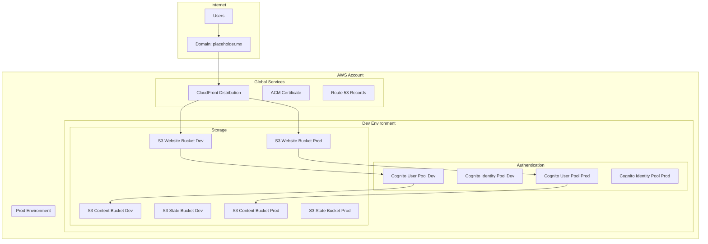
```mermaid
graph TB
    subgraph "Internet"
        U[Users]
        D[Domain: placeholder.mx]
    end
    
    subgraph "AWS Account"
        subgraph "Global Services"
            CF[CloudFront Distribution]
            ACM[ACM Certificate]
            R53[Route 53 Records]
        end
        
        subgraph "Dev Environment"
            subgraph "Authentication"
                CUD[Cognito User Pool Dev]
                CID[Cognito Identity Pool Dev]
            end
            
            subgraph "Storage"
                S3WD[S3 Website Bucket Dev]
                S3CD[S3 Content Bucket Dev]
                S3SD[S3 State Bucket Dev]
            end
        end
        
        subgraph "Prod Environment"
            subgraph "Authentication"
                CUP[Cognito User Pool Prod]
                CIP[Cognito Identity Pool Prod]
            end
            
            subgraph "Storage"
                S3WP[S3 Website Bucket Prod]
                S3CP[S3 Content Bucket Prod]
                S3SP[S3 State Bucket Prod]
            end
        end
    end
    
    U --> D
    D --> CF
    CF --> S3WD
    CF --> S3WP
    S3WD --> CUD
    S3WP --> CUP
    CUD --> S3CD
    CUP --> S3CP
```

### Component Interaction Flow

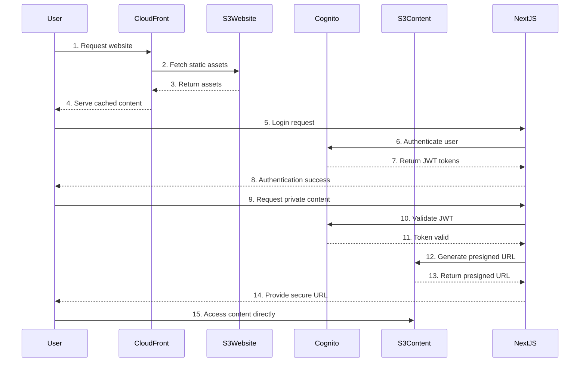
```mermaid
sequenceDiagram
    participant User
    participant CloudFront
    participant S3Website
    participant Cognito
    participant S3Content
    participant NextJS

    User->>CloudFront: 1. Request website
    CloudFront->>S3Website: 2. Fetch static assets
    S3Website-->>CloudFront: 3. Return assets
    CloudFront-->>User: 4. Serve cached content
    
    User->>NextJS: 5. Login request
    NextJS->>Cognito: 6. Authenticate user
    Cognito-->>NextJS: 7. Return JWT tokens
    NextJS-->>User: 8. Authentication success
    
    User->>NextJS: 9. Request private content
    NextJS->>Cognito: 10. Validate JWT
    Cognito-->>NextJS: 11. Token valid
    NextJS->>S3Content: 12. Generate presigned URL
    S3Content-->>NextJS: 13. Return presigned URL
    NextJS-->>User: 14. Provide secure URL
    User->>S3Content: 15. Access content directly
```

## Infrastructure Components

### 1. Content Delivery Network (CloudFront)

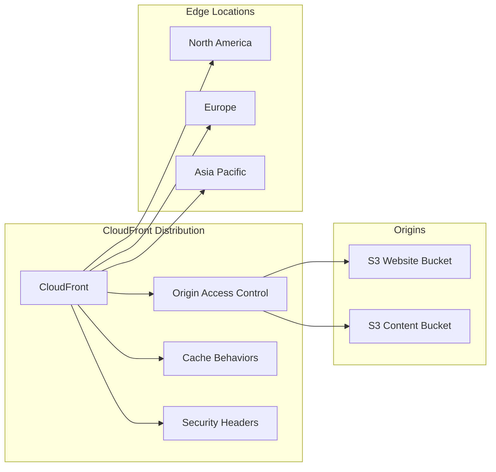
```mermaid
graph LR
    subgraph "CloudFront Distribution"
        CF[CloudFront]
        OAC[Origin Access Control]
        Cache[Cache Behaviors]
        Headers[Security Headers]
    end
    
    subgraph "Origins"
        S3W[S3 Website Bucket]
        S3C[S3 Content Bucket]
    end
    
    subgraph "Edge Locations"
        E1[North America]
        E2[Europe]
        E3[Asia Pacific]
    end
    
    CF --> OAC
    CF --> Cache
    CF --> Headers
    OAC --> S3W
    OAC --> S3C
    CF --> E1
    CF --> E2
    CF --> E3
```

**Key Features:**
- Global content distribution
- Origin Access Control for S3 security
- Custom caching behaviors for Next.js
- Security headers (HSTS, CSP, X-Frame-Options)
- SSL/TLS termination with ACM certificates

### 2. Authentication System (Cognito)

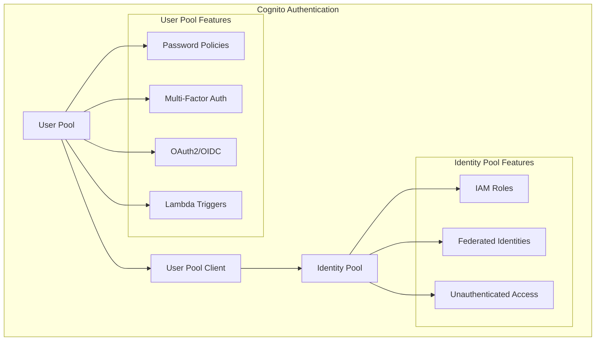
```mermaid
graph TB
    subgraph "Cognito Authentication"
        UP[User Pool]
        UPC[User Pool Client]
        IP[Identity Pool]
        
        subgraph "User Pool Features"
            PWD[Password Policies]
            MFA[Multi-Factor Auth]
            OAUTH[OAuth2/OIDC]
            LAMBDA[Lambda Triggers]
        end
        
        subgraph "Identity Pool Features"
            ROLES[IAM Roles]
            FEDERATED[Federated Identities]
            UNAUTH[Unauthenticated Access]
        end
    end
    
    UP --> UPC
    UP --> PWD
    UP --> MFA
    UP --> OAUTH
    UP --> LAMBDA
    
    IP --> ROLES
    IP --> FEDERATED
    IP --> UNAUTH
    
    UPC --> IP
```

**Authentication Flow:**
1. User registers/signs in through User Pool
2. User Pool validates credentials and policies
3. Returns JWT tokens (ID, Access, Refresh)
4. Identity Pool exchanges tokens for AWS credentials
5. User can access AWS resources with temporary credentials

### 3. Storage Architecture

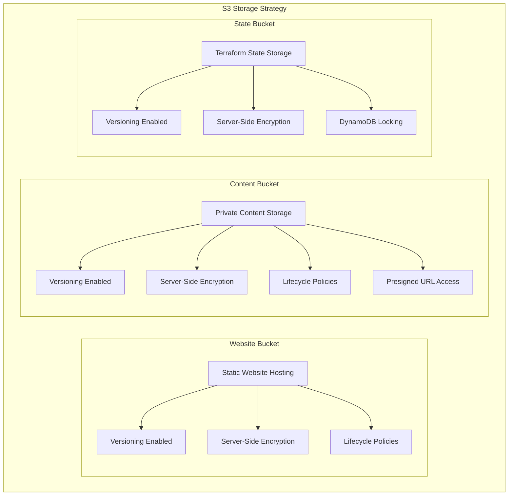
```mermaid
graph TB
    subgraph "S3 Storage Strategy"
        subgraph "Website Bucket"
            WB[Static Website Hosting]
            WV[Versioning Enabled]
            WE[Server-Side Encryption]
            WL[Lifecycle Policies]
        end
        
        subgraph "Content Bucket"
            CB[Private Content Storage]
            CV[Versioning Enabled]
            CE[Server-Side Encryption]
            CL[Lifecycle Policies]
            CP[Presigned URL Access]
        end
        
        subgraph "State Bucket"
            SB[Terraform State Storage]
            SV[Versioning Enabled]
            SE[Server-Side Encryption]
            SL[DynamoDB Locking]
        end
    end
    
    WB --> WV
    WB --> WE
    WB --> WL
    
    CB --> CV
    CB --> CE
    CB --> CL
    CB --> CP
    
    SB --> SV
    SB --> SE
    SB --> SL
```

### 4. DNS and Certificate Management

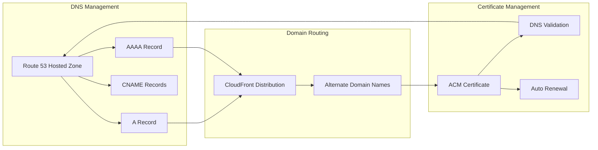
```mermaid
graph LR
    subgraph "DNS Management"
        R53[Route 53 Hosted Zone]
        A[A Record]
        AAAA[AAAA Record]
        CNAME[CNAME Records]
    end
    
    subgraph "Certificate Management"
        ACM[ACM Certificate]
        DNS_VAL[DNS Validation]
        AUTO_RENEW[Auto Renewal]
    end
    
    subgraph "Domain Routing"
        CF[CloudFront Distribution]
        ALT[Alternate Domain Names]
    end
    
    R53 --> A
    R53 --> AAAA
    R53 --> CNAME
    
    ACM --> DNS_VAL
    ACM --> AUTO_RENEW
    DNS_VAL --> R53
    
    CF --> ALT
    ALT --> ACM
    A --> CF
    AAAA --> CF
```

## Environment Architecture

### Development Environment

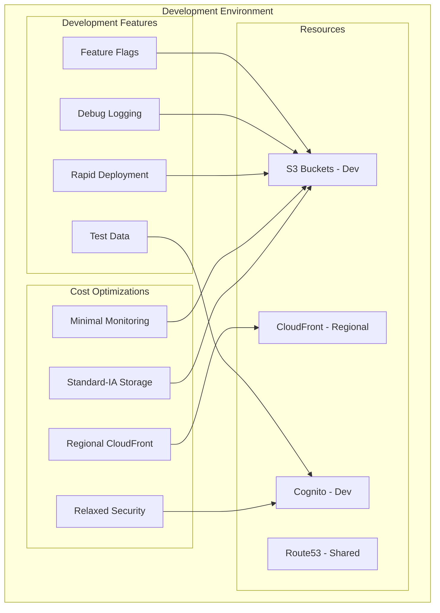
```mermaid
graph TB
    subgraph "Development Environment"
        subgraph "Cost Optimizations"
            CO1[Standard-IA Storage]
            CO2[Regional CloudFront]
            CO3[Minimal Monitoring]
            CO4[Relaxed Security]
        end
        
        subgraph "Development Features"
            DF1[Rapid Deployment]
            DF2[Debug Logging]
            DF3[Test Data]
            DF4[Feature Flags]
        end
        
        subgraph "Resources"
            DR1[S3 Buckets - Dev]
            DR2[Cognito - Dev]
            DR3[CloudFront - Regional]
            DR4[Route53 - Shared]
        end
    end
    
    CO1 --> DR1
    CO2 --> DR3
    CO3 --> DR1
    CO4 --> DR2
    
    DF1 --> DR1
    DF2 --> DR1
    DF3 --> DR2
    DF4 --> DR1
```

### Production Environment

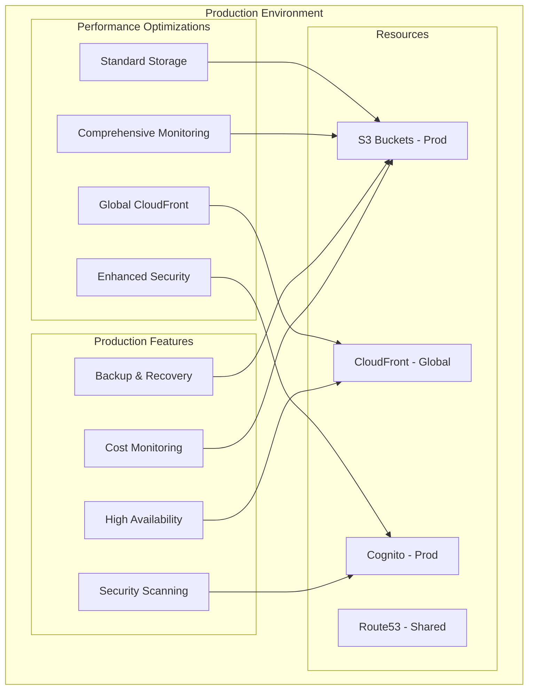
```mermaid
graph TB
    subgraph "Production Environment"
        subgraph "Performance Optimizations"
            PO1[Standard Storage]
            PO2[Global CloudFront]
            PO3[Comprehensive Monitoring]
            PO4[Enhanced Security]
        end
        
        subgraph "Production Features"
            PF1[High Availability]
            PF2[Backup & Recovery]
            PF3[Security Scanning]
            PF4[Cost Monitoring]
        end
        
        subgraph "Resources"
            PR1[S3 Buckets - Prod]
            PR2[Cognito - Prod]
            PR3[CloudFront - Global]
            PR4[Route53 - Shared]
        end
    end
    
    PO1 --> PR1
    PO2 --> PR3
    PO3 --> PR1
    PO4 --> PR2
    
    PF1 --> PR3
    PF2 --> PR1
    PF3 --> PR2
    PF4 --> PR1
```

## Deployment Architecture

### Infrastructure as Code Structure

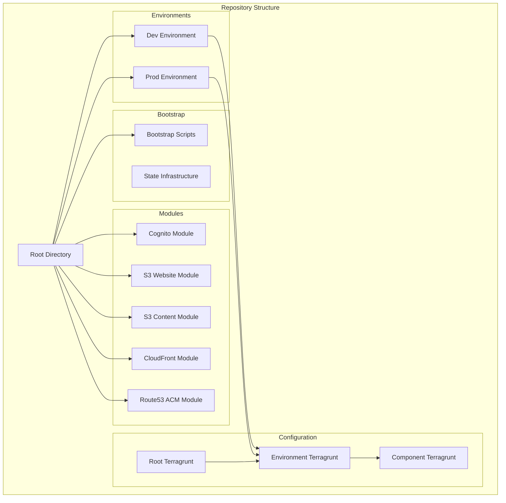
```mermaid
graph TB
    subgraph "Repository Structure"
        ROOT[Root Directory]
        
        subgraph "Bootstrap"
            BS[Bootstrap Scripts]
            BT[State Infrastructure]
        end
        
        subgraph "Modules"
            M1[Cognito Module]
            M2[S3 Website Module]
            M3[S3 Content Module]
            M4[CloudFront Module]
            M5[Route53 ACM Module]
        end
        
        subgraph "Environments"
            ENV_DEV[Dev Environment]
            ENV_PROD[Prod Environment]
        end
        
        subgraph "Configuration"
            TG_ROOT[Root Terragrunt]
            TG_ENV[Environment Terragrunt]
            TG_COMP[Component Terragrunt]
        end
    end
    
    ROOT --> BS
    ROOT --> M1
    ROOT --> M2
    ROOT --> M3
    ROOT --> M4
    ROOT --> M5
    ROOT --> ENV_DEV
    ROOT --> ENV_PROD
    
    ENV_DEV --> TG_ENV
    ENV_PROD --> TG_ENV
    TG_ENV --> TG_COMP
    TG_ROOT --> TG_ENV
```

### Deployment Flow

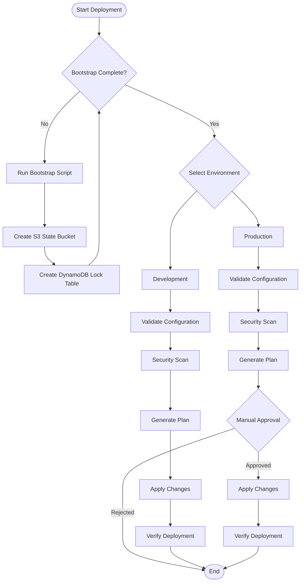
```mermaid
flowchart TD
    START([Start Deployment]) --> BOOTSTRAP{Bootstrap Complete?}
    
    BOOTSTRAP -->|No| RUN_BOOTSTRAP[Run Bootstrap Script]
    RUN_BOOTSTRAP --> CREATE_STATE[Create S3 State Bucket]
    CREATE_STATE --> CREATE_LOCK[Create DynamoDB Lock Table]
    CREATE_LOCK --> BOOTSTRAP
    
    BOOTSTRAP -->|Yes| SELECT_ENV{Select Environment}
    
    SELECT_ENV --> DEV[Development]
    SELECT_ENV --> PROD[Production]
    
    DEV --> DEV_VALIDATE[Validate Configuration]
    PROD --> PROD_VALIDATE[Validate Configuration]
    
    DEV_VALIDATE --> DEV_SECURITY[Security Scan]
    PROD_VALIDATE --> PROD_SECURITY[Security Scan]
    
    DEV_SECURITY --> DEV_PLAN[Generate Plan]
    PROD_SECURITY --> PROD_PLAN[Generate Plan]
    
    DEV_PLAN --> DEV_APPLY[Apply Changes]
    PROD_PLAN --> PROD_APPROVAL{Manual Approval}
    
    PROD_APPROVAL -->|Approved| PROD_APPLY[Apply Changes]
    PROD_APPROVAL -->|Rejected| END([End])
    
    DEV_APPLY --> DEV_VERIFY[Verify Deployment]
    PROD_APPLY --> PROD_VERIFY[Verify Deployment]
    
    DEV_VERIFY --> END
    PROD_VERIFY --> END
```

### Component Dependency Graph

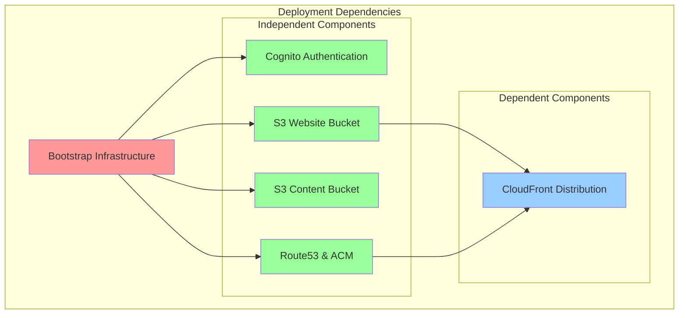
```mermaid
graph TD
    subgraph "Deployment Dependencies"
        BOOTSTRAP[Bootstrap Infrastructure]
        
        subgraph "Independent Components"
            COGNITO[Cognito Authentication]
            S3_WEBSITE[S3 Website Bucket]
            S3_CONTENT[S3 Content Bucket]
            ROUTE53[Route53 & ACM]
        end
        
        subgraph "Dependent Components"
            CLOUDFRONT[CloudFront Distribution]
        end
    end
    
    BOOTSTRAP --> COGNITO
    BOOTSTRAP --> S3_WEBSITE
    BOOTSTRAP --> S3_CONTENT
    BOOTSTRAP --> ROUTE53
    
    S3_WEBSITE --> CLOUDFRONT
    ROUTE53 --> CLOUDFRONT
    
    style BOOTSTRAP fill:#ff9999
    style CLOUDFRONT fill:#99ccff
    style COGNITO fill:#99ff99
    style S3_WEBSITE fill:#99ff99
    style S3_CONTENT fill:#99ff99
    style ROUTE53 fill:#99ff99
```

## Security Architecture

### Security Layers

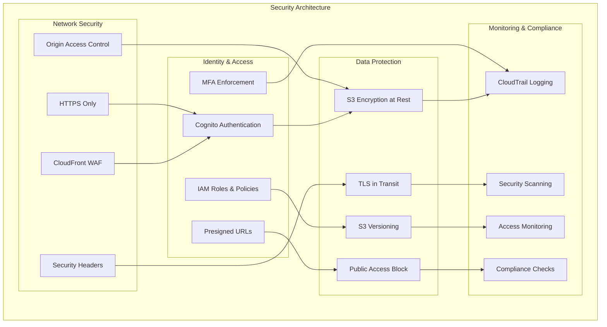
```mermaid
graph TB
    subgraph "Security Architecture"
        subgraph "Network Security"
            NS1[HTTPS Only]
            NS2[CloudFront WAF]
            NS3[Origin Access Control]
            NS4[Security Headers]
        end
        
        subgraph "Identity & Access"
            IA1[Cognito Authentication]
            IA2[IAM Roles & Policies]
            IA3[Presigned URLs]
            IA4[MFA Enforcement]
        end
        
        subgraph "Data Protection"
            DP1[S3 Encryption at Rest]
            DP2[TLS in Transit]
            DP3[S3 Versioning]
            DP4[Public Access Block]
        end
        
        subgraph "Monitoring & Compliance"
            MC1[CloudTrail Logging]
            MC2[Security Scanning]
            MC3[Access Monitoring]
            MC4[Compliance Checks]
        end
    end
    
    NS1 --> IA1
    NS2 --> IA1
    NS3 --> DP1
    NS4 --> DP2
    
    IA1 --> DP1
    IA2 --> DP3
    IA3 --> DP4
    IA4 --> MC1
    
    DP1 --> MC1
    DP2 --> MC2
    DP3 --> MC3
    DP4 --> MC4
```

### Data Flow Security

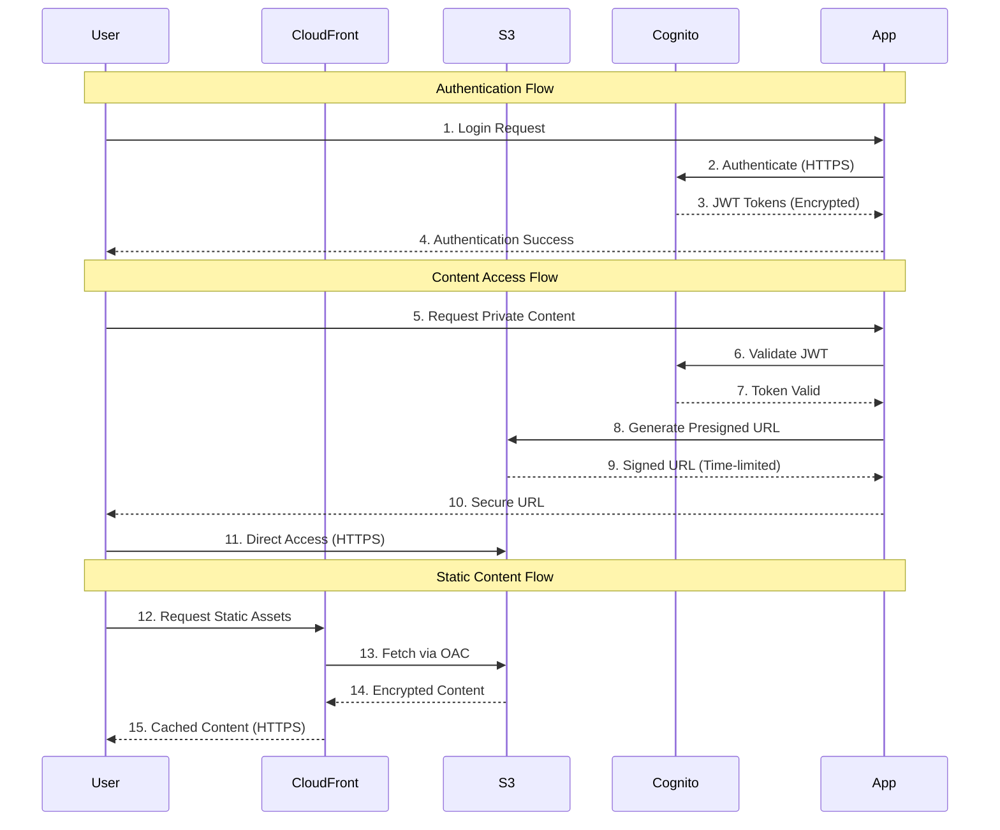
```mermaid
sequenceDiagram
    participant User
    participant CloudFront
    participant S3
    participant Cognito
    participant App
    
    Note over User,App: Authentication Flow
    User->>App: 1. Login Request
    App->>Cognito: 2. Authenticate (HTTPS)
    Cognito-->>App: 3. JWT Tokens (Encrypted)
    App-->>User: 4. Authentication Success
    
    Note over User,App: Content Access Flow
    User->>App: 5. Request Private Content
    App->>Cognito: 6. Validate JWT
    Cognito-->>App: 7. Token Valid
    App->>S3: 8. Generate Presigned URL
    S3-->>App: 9. Signed URL (Time-limited)
    App-->>User: 10. Secure URL
    User->>S3: 11. Direct Access (HTTPS)
    
    Note over User,App: Static Content Flow
    User->>CloudFront: 12. Request Static Assets
    CloudFront->>S3: 13. Fetch via OAC
    S3-->>CloudFront: 14. Encrypted Content
    CloudFront-->>User: 15. Cached Content (HTTPS)
```

## Monitoring and Observability

### Monitoring Architecture

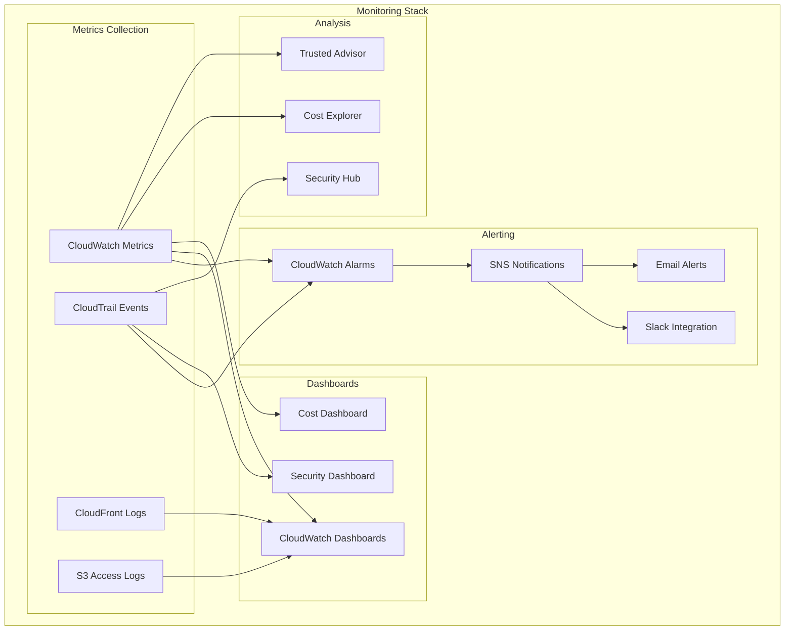
```mermaid
graph TB
    subgraph "Monitoring Stack"
        subgraph "Metrics Collection"
            CW[CloudWatch Metrics]
            CT[CloudTrail Events]
            CF_LOGS[CloudFront Logs]
            S3_LOGS[S3 Access Logs]
        end
        
        subgraph "Alerting"
            CW_ALARMS[CloudWatch Alarms]
            SNS[SNS Notifications]
            SLACK[Slack Integration]
            EMAIL[Email Alerts]
        end
        
        subgraph "Dashboards"
            CW_DASH[CloudWatch Dashboards]
            COST_DASH[Cost Dashboard]
            SEC_DASH[Security Dashboard]
        end
        
        subgraph "Analysis"
            COST_EXPLORER[Cost Explorer]
            TRUSTED_ADVISOR[Trusted Advisor]
            SECURITY_HUB[Security Hub]
        end
    end
    
    CW --> CW_ALARMS
    CT --> CW_ALARMS
    CF_LOGS --> CW_DASH
    S3_LOGS --> CW_DASH
    
    CW_ALARMS --> SNS
    SNS --> SLACK
    SNS --> EMAIL
    
    CW --> CW_DASH
    CW --> COST_DASH
    CT --> SEC_DASH
    
    CW --> COST_EXPLORER
    CW --> TRUSTED_ADVISOR
    CT --> SECURITY_HUB
```

## Disaster Recovery Architecture

### Backup and Recovery Strategy

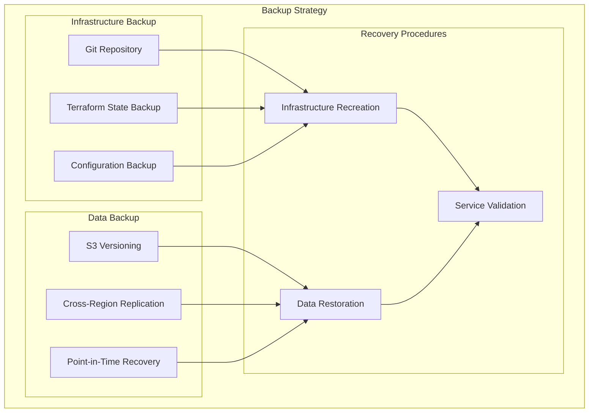
```mermaid
graph TB
    subgraph "Backup Strategy"
        subgraph "Infrastructure Backup"
            IB1[Git Repository]
            IB2[Terraform State Backup]
            IB3[Configuration Backup]
        end
        
        subgraph "Data Backup"
            DB1[S3 Versioning]
            DB2[Cross-Region Replication]
            DB3[Point-in-Time Recovery]
        end
        
        subgraph "Recovery Procedures"
            RP1[Infrastructure Recreation]
            RP2[Data Restoration]
            RP3[Service Validation]
        end
    end
    
    IB1 --> RP1
    IB2 --> RP1
    IB3 --> RP1
    
    DB1 --> RP2
    DB2 --> RP2
    DB3 --> RP2
    
    RP1 --> RP3
    RP2 --> RP3
```

### Recovery Time Objectives (RTO) and Recovery Point Objectives (RPO)

| Component | RTO | RPO | Recovery Method |
|-----------|-----|-----|-----------------|
| **Static Website** | 15 minutes | 1 hour | Redeploy from Git |
| **User Data** | 30 minutes | 15 minutes | S3 versioning restore |
| **Authentication** | 45 minutes | 1 hour | Recreate Cognito pools |
| **Infrastructure** | 60 minutes | 24 hours | Terraform recreation |
| **DNS/SSL** | 5 minutes | N/A | Route53 failover |

## Performance Architecture

### Caching Strategy

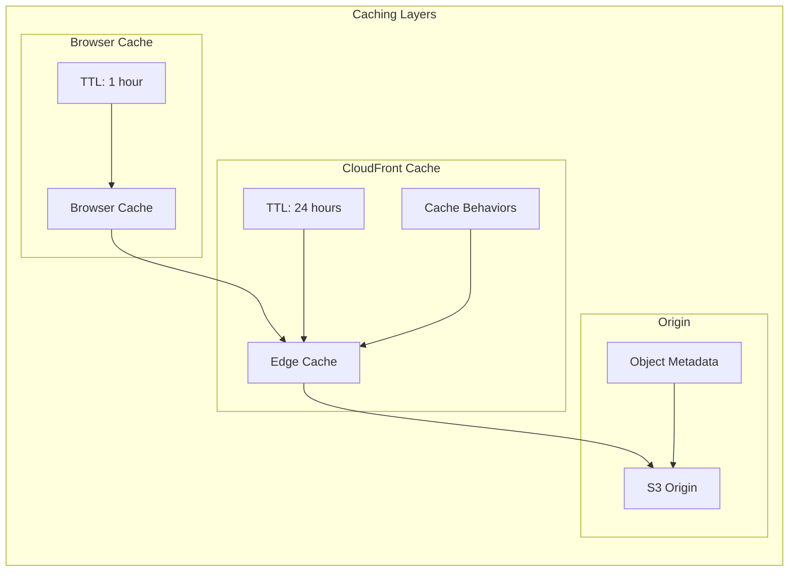
```mermaid
graph LR
    subgraph "Caching Layers"
        subgraph "Browser Cache"
            BC[Browser Cache]
            BC_TTL[TTL: 1 hour]
        end
        
        subgraph "CloudFront Cache"
            CF_CACHE[Edge Cache]
            CF_TTL[TTL: 24 hours]
            CF_BEHAVIORS[Cache Behaviors]
        end
        
        subgraph "Origin"
            S3_ORIGIN[S3 Origin]
            S3_METADATA[Object Metadata]
        end
    end
    
    BC --> CF_CACHE
    BC_TTL --> BC
    
    CF_CACHE --> S3_ORIGIN
    CF_TTL --> CF_CACHE
    CF_BEHAVIORS --> CF_CACHE
    
    S3_METADATA --> S3_ORIGIN
```

### Performance Optimization

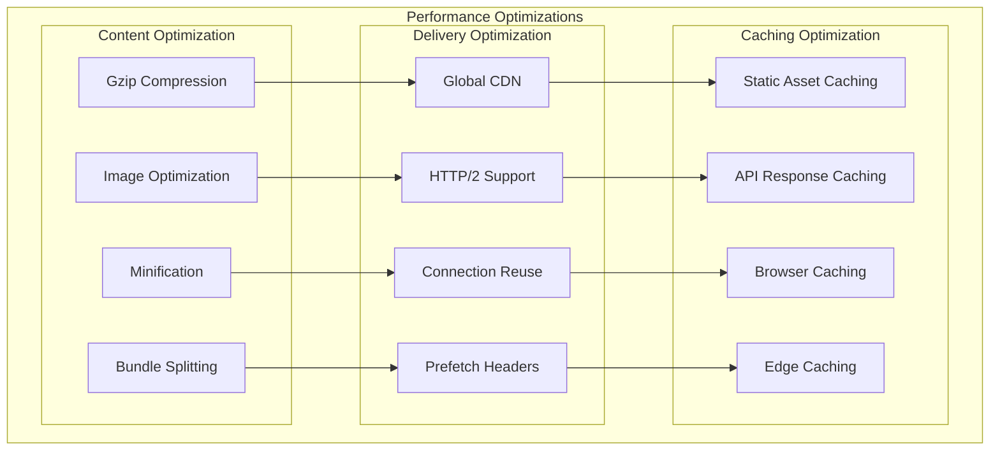
```mermaid
graph TB
    subgraph "Performance Optimizations"
        subgraph "Content Optimization"
            CO1[Gzip Compression]
            CO2[Image Optimization]
            CO3[Minification]
            CO4[Bundle Splitting]
        end
        
        subgraph "Delivery Optimization"
            DO1[Global CDN]
            DO2[HTTP/2 Support]
            DO3[Connection Reuse]
            DO4[Prefetch Headers]
        end
        
        subgraph "Caching Optimization"
            CAO1[Static Asset Caching]
            CAO2[API Response Caching]
            CAO3[Browser Caching]
            CAO4[Edge Caching]
        end
    end
    
    CO1 --> DO1
    CO2 --> DO2
    CO3 --> DO3
    CO4 --> DO4
    
    DO1 --> CAO1
    DO2 --> CAO2
    DO3 --> CAO3
    DO4 --> CAO4
```

## Cost Architecture

### Cost Optimization Strategy

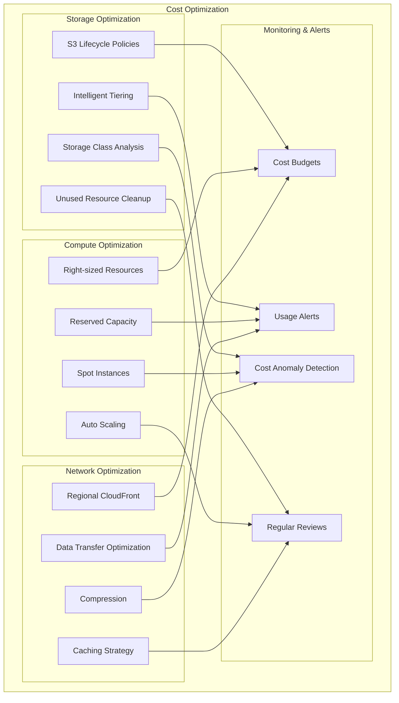
```mermaid
graph TB
    subgraph "Cost Optimization"
        subgraph "Storage Optimization"
            SO1[S3 Lifecycle Policies]
            SO2[Intelligent Tiering]
            SO3[Storage Class Analysis]
            SO4[Unused Resource Cleanup]
        end
        
        subgraph "Compute Optimization"
            CO1[Right-sized Resources]
            CO2[Reserved Capacity]
            CO3[Spot Instances]
            CO4[Auto Scaling]
        end
        
        subgraph "Network Optimization"
            NO1[Regional CloudFront]
            NO2[Data Transfer Optimization]
            NO3[Compression]
            NO4[Caching Strategy]
        end
        
        subgraph "Monitoring & Alerts"
            MA1[Cost Budgets]
            MA2[Usage Alerts]
            MA3[Cost Anomaly Detection]
            MA4[Regular Reviews]
        end
    end
    
    SO1 --> MA1
    SO2 --> MA2
    SO3 --> MA3
    SO4 --> MA4
    
    CO1 --> MA1
    CO2 --> MA2
    CO3 --> MA3
    CO4 --> MA4
    
    NO1 --> MA1
    NO2 --> MA2
    NO3 --> MA3
    NO4 --> MA4
```

## Integration Architecture

### Next.js Application Integration

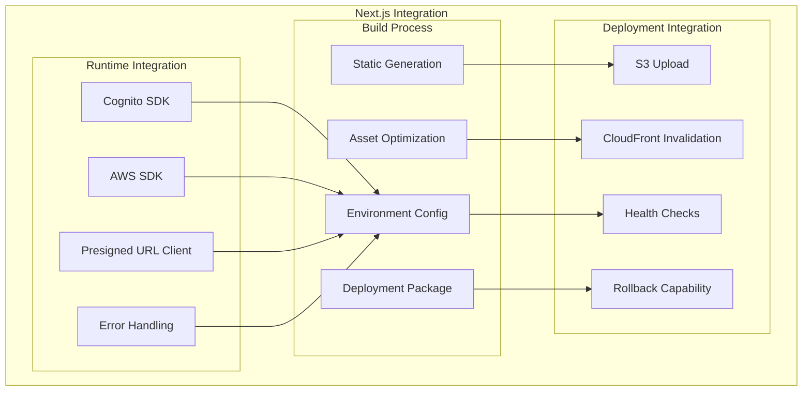
```mermaid
graph TB
    subgraph "Next.js Integration"
        subgraph "Build Process"
            BP1[Static Generation]
            BP2[Asset Optimization]
            BP3[Environment Config]
            BP4[Deployment Package]
        end
        
        subgraph "Runtime Integration"
            RI1[Cognito SDK]
            RI2[AWS SDK]
            RI3[Presigned URL Client]
            RI4[Error Handling]
        end
        
        subgraph "Deployment Integration"
            DI1[S3 Upload]
            DI2[CloudFront Invalidation]
            DI3[Health Checks]
            DI4[Rollback Capability]
        end
    end
    
    BP1 --> DI1
    BP2 --> DI2
    BP3 --> DI3
    BP4 --> DI4
    
    RI1 --> BP3
    RI2 --> BP3
    RI3 --> BP3
    RI4 --> BP3
```

This architecture documentation provides a comprehensive view of the system design, component interactions, security considerations, and operational aspects of the Terraform Next.js infrastructure project.