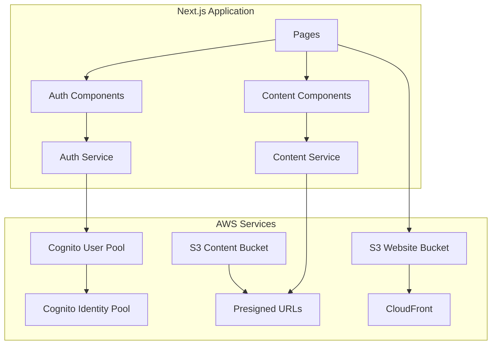

# Next.js Integration Examples

This directory contains comprehensive examples for integrating your Next.js application with the AWS infrastructure deployed by this Terraform/Terragrunt configuration.

## 🚀 Quick Start

1. **Install Dependencies**
   ```bash
   cd examples/nextjs-integration
   npm install
   ```

2. **Configure Environment**
   ```bash
   cp config/env.example .env.local
   # Edit .env.local with your Terraform outputs
   ```

3. **Start Development**
   ```bash
   npm run dev
   ```

4. **Deploy to AWS**
   ```bash
   npm run deploy:dev  # or deploy:prod
   ```

## 📋 Overview

The examples demonstrate:
- **AWS Cognito Authentication**: Complete user management with registration, login, MFA, and profile management
- **S3 Presigned URLs**: Secure file uploads and downloads with progress tracking
- **Deployment Automation**: Scripts for deploying Next.js static exports to S3 with CloudFront invalidation
- **Environment Management**: Separate configurations for development and production
- **Security Best Practices**: Route protection, token management, and secure API endpoints

## 🏗️ Architecture



## 📁 Directory Structure

```
examples/nextjs-integration/
├── 📄 README.md                      # This file
├── 📄 SETUP.md                       # Detailed setup guide
├── 📄 package.json                   # Dependencies and scripts
├── 🔐 auth/                          # Authentication components
│   ├── auth-service.js               # Cognito authentication service
│   ├── auth-context.jsx              # React context for auth state
│   ├── auth-components.jsx           # Ready-to-use auth components
│   └── auth-middleware.js            # Next.js middleware for route protection
├── 📁 content/                       # Content management
│   ├── content-service.js            # S3 presigned URL service
│   ├── content-components.jsx        # Content management components
│   └── content-utils.js              # Utility functions
├── ⚙️ config/                        # Configuration files
│   ├── env.example                   # Environment variables template
│   ├── next.config.js               # Next.js configuration
│   └── amplify-config.js            # AWS Amplify configuration
├── 🚀 deployment/                    # Deployment scripts
│   ├── deploy-to-s3.js              # Node.js deployment script
│   ├── deploy-to-s3.sh              # Shell deployment script
│   └── deploy-to-s3.ps1             # PowerShell deployment script
└── 📱 pages/                         # Next.js pages and API routes
    ├── api/                          # API endpoints
    │   ├── aws-credentials.js        # AWS credentials exchange
    │   └── content/                  # Content management APIs
    ├── auth/                         # Authentication pages
    │   ├── login.jsx                 # Login page
    │   ├── register.jsx              # Registration page
    │   ├── verify.jsx                # Email verification
    │   └── profile.jsx               # User profile management
    └── content/                      # Content pages
        └── gallery.jsx               # Content gallery with uploads
```

## ✨ Key Features

### 🔐 Authentication (AWS Cognito)
- **User Registration** with email verification
- **Secure Login** with password validation
- **Password Management** (change, reset, forgot password)
- **Profile Management** (update user attributes)
- **Route Protection** with Next.js middleware
- **Session Management** with automatic token refresh
- **MFA Support** for enhanced security

### 📁 Content Management (S3 Presigned URLs)
- **Secure File Uploads** with progress tracking
- **File Downloads** with temporary URLs
- **Content Gallery** with thumbnail previews
- **File Management** (list, view, delete)
- **File Validation** (type, size, format)
- **Batch Operations** for multiple files

### 🚀 Deployment & Infrastructure
- **Static Export** optimized for S3 hosting
- **CloudFront Integration** with cache invalidation
- **Environment Support** (dev/staging/prod)
- **Automated Deployment** scripts
- **CI/CD Ready** with GitHub Actions support

## 🛠️ Prerequisites

Before using these examples, ensure you have:

1. **Deployed AWS Infrastructure**
   ```bash
   cd environments/dev  # or prod
   terragrunt run-all apply
   ```

2. **Node.js & npm**
   - Node.js ≥ 18.0.0
   - npm ≥ 8.0.0

3. **AWS CLI** (for deployment)
   ```bash
   aws configure
   ```

## 📦 Dependencies

The integration uses these key dependencies:

```json
{
  "dependencies": {
    "next": "^14.0.0",
    "react": "^18.2.0",
    "aws-amplify": "^6.0.0",
    "@aws-amplify/auth": "^6.0.0",
    "@aws-sdk/client-s3": "^3.450.0",
    "@aws-sdk/s3-request-presigner": "^3.450.0",
    "@aws-sdk/client-cognito-identity": "^3.450.0"
  }
}
```

## 🔧 Configuration

### Environment Variables

Copy and configure your environment variables:

```bash
cp config/env.example .env.local
```

Key variables from your Terraform outputs:

```env
# From: terragrunt run-all output
NEXT_PUBLIC_COGNITO_USER_POOL_ID=us-east-1_XXXXXXXXX
NEXT_PUBLIC_COGNITO_USER_POOL_CLIENT_ID=XXXXXXXXXXXXXXXXXXXXXXXXXX
NEXT_PUBLIC_S3_CONTENT_BUCKET=my-app-dev-content-abc123
NEXT_PUBLIC_CLOUDFRONT_DISTRIBUTION_ID=E1234567890123
```

### Next.js Configuration

The `next.config.js` is pre-configured for:
- Static export for S3 hosting
- CloudFront asset optimization
- Security headers
- Environment-specific settings

## 💻 Usage Examples

### Authentication

```jsx
import { useAuth } from '../auth/auth-context';
import { LoginForm, UserProfile } from '../auth/auth-components';

function MyApp() {
  const { user, isAuthenticated, signOut } = useAuth();

  if (!isAuthenticated) {
    return <LoginForm onSuccess={() => router.push('/dashboard')} />;
  }

  return (
    <div>
      <h1>Welcome, {user.attributes.given_name}!</h1>
      <UserProfile />
      <button onClick={signOut}>Sign Out</button>
    </div>
  );
}
```

### Content Management

```jsx
import { FileUpload, ContentGrid } from '../content/content-components';
import contentService from '../content/content-service';

function ContentPage() {
  const [content, setContent] = useState([]);

  const handleUpload = async (uploadedFile) => {
    // File automatically uploaded via presigned URL
    await loadContent(); // Refresh the list
  };

  const handleDownload = async (item) => {
    await contentService.downloadFile(item.key, item.name);
  };

  return (
    <div>
      <FileUpload 
        onUploadComplete={handleUpload}
        allowedTypes={['image/*', 'application/pdf']}
        maxSize={10 * 1024 * 1024} // 10MB
      />
      <ContentGrid 
        content={content}
        onDownload={handleDownload}
        onDelete={handleDelete}
      />
    </div>
  );
}
```

## 🚀 Deployment

### Development
```bash
npm run deploy:dev
```

### Production
```bash
npm run deploy:prod
```

### Manual Deployment
```bash
# Build static export
npm run build

# Deploy to S3 with CloudFront invalidation
node deployment/deploy-to-s3.js
```

## 🔒 Security Features

- **Route Protection**: Middleware-based authentication
- **Token Management**: Secure storage and automatic refresh
- **CORS Configuration**: Properly configured for S3 and CloudFront
- **Content Security Policy**: Configured for AWS services
- **Input Validation**: Client and server-side validation
- **Presigned URL Expiration**: Short-lived URLs for security

## 🎯 Performance Optimizations

- **Static Export**: Optimized for S3 static hosting
- **CloudFront CDN**: Global content delivery
- **Code Splitting**: Automatic bundle optimization
- **Image Optimization**: Next.js Image component support
- **Caching Strategy**: Optimized cache headers
- **Bundle Analysis**: Built-in bundle analyzer

## 🐛 Troubleshooting

### Common Issues

1. **Authentication Errors**
   - Verify Cognito configuration in `.env.local`
   - Check OAuth redirect URLs match your domain

2. **Upload Failures**
   - Verify S3 bucket permissions
   - Check CORS configuration
   - Validate file types and sizes

3. **Deployment Issues**
   - Ensure AWS credentials are configured
   - Verify S3 bucket and CloudFront permissions

### Debug Mode

Enable debug logging:
```env
NEXT_PUBLIC_ENABLE_DEBUG_MODE=true
```

## 📚 Documentation

- **[SETUP.md](./SETUP.md)**: Detailed setup instructions
- **[Main Documentation](../../docs/)**: Infrastructure documentation
- **Component Documentation**: Inline JSDoc comments
- **API Documentation**: OpenAPI specs in API route files

## 🤝 Contributing

1. Follow the existing code structure
2. Add JSDoc comments for new functions
3. Update environment variable examples
4. Test in both dev and prod environments

## 📄 License

This project is licensed under the MIT License - see the main project LICENSE file for details.

## 🆘 Support

- Check the [SETUP.md](./SETUP.md) for detailed instructions
- Review the main project documentation in `/docs`
- Check browser console for client-side errors
- Review server logs for API errors
- Verify Terraform outputs match environment variables