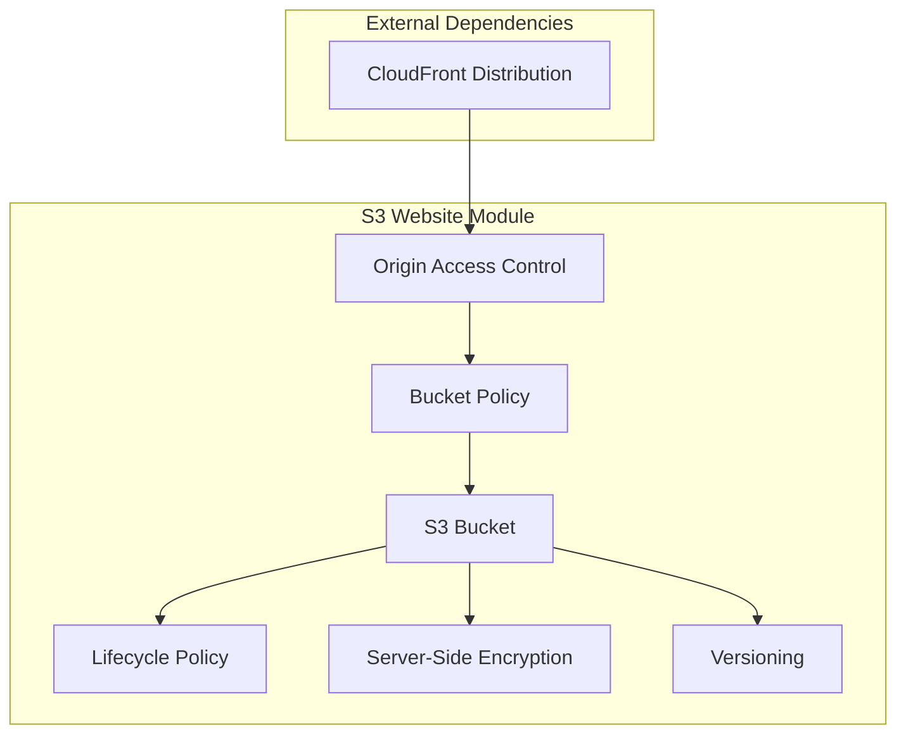

# S3 Website Hosting Module

This Terraform module creates an S3 bucket configured for static website hosting with CloudFront origin access control and cost optimization features.

## Features

- **Static Website Hosting**: Configures S3 bucket for hosting static websites with custom index and error documents
- **CloudFront Integration**: Creates Origin Access Control (OAC) for secure CloudFront access
- **Cost Optimization**: Implements lifecycle policies with environment-specific storage class transitions
- **Security**: Enforces server-side encryption and proper access controls
- **Versioning Support**: Optional S3 versioning with cleanup policies
- **Environment Awareness**: Different configurations for dev/staging/prod environments

## Usage

### Basic Usage

```hcl
module "s3_website" {
  source = "./modules/s3-website"

  project_name                = "my-nextjs-app"
  environment                 = "dev"
  cloudfront_distribution_arn = "arn:aws:cloudfront::123456789012:distribution/ABCDEFGHIJKLMN"

  tags = {
    Project = "NextJS Infrastructure"
    Owner   = "DevOps Team"
  }
}
```

### Advanced Usage with Custom Configuration

```hcl
module "s3_website" {
  source = "./modules/s3-website"

  project_name                = "my-nextjs-app"
  environment                 = "prod"
  cloudfront_distribution_arn = "arn:aws:cloudfront::123456789012:distribution/ABCDEFGHIJKLMN"
  
  # Website configuration
  index_document = "index.html"
  error_document = "404.html"
  
  # Enable features for production
  enable_versioning       = true
  enable_lifecycle_policy = true
  
  # Custom routing rules
  routing_rules = [
    {
      condition = {
        key_prefix_equals = "old-path/"
      }
      redirect = {
        replace_key_prefix_with = "new-path/"
      }
    }
  ]

  tags = {
    Project     = "NextJS Infrastructure"
    Owner       = "DevOps Team"
    Environment = "production"
  }
}
```

## Architecture



## Cost Optimization

The module implements several cost optimization strategies:

### Environment-Based Storage Classes
- **Development**: Uses `STANDARD_IA` for reduced costs
- **Production**: Uses `STANDARD` for optimal performance

### Lifecycle Policies
- **Development Environment**:
  - Transition to IA after 7 days
  - Transition to Glacier after 14 days
  - Delete old versions after 90 days
- **Production Environment**:
  - Transition to IA after 30 days
  - Transition to Glacier after 60 days
  - Delete old versions after 365 days

### Cleanup Rules
- Automatically removes incomplete multipart uploads after 7 days
- Deletes expired object delete markers
- Manages noncurrent versions when versioning is enabled

## Security Features

### Access Control
- **Origin Access Control (OAC)**: Restricts S3 access to CloudFront only
- **Bucket Policy**: Allows access only from specified CloudFront distribution
- **Public Access Block**: Prevents accidental public access
- **Secure Transport**: Denies all non-HTTPS requests
- **ACL Restrictions**: Prevents public ACL assignments

### Encryption
- **Server-Side Encryption**: AES-256 encryption (cost-effective and secure)
- **Encryption Enforcement**: Denies unencrypted object uploads
- **Bucket Key**: Enabled for cost optimization

### Data Protection
- **Object Lock**: Optional WORM (Write Once Read Many) protection
- **Versioning**: Optional with automated cleanup policies
- **Request Payment**: Configured to prevent abuse

### Monitoring & Auditing
- **Access Logging**: Optional S3 access logs for security auditing
- **Intelligent Tiering**: Optional automated cost optimization

### Validation
- Input validation for project names and environment values
- CloudFront ARN format validation
- Object lock retention period validation

## Requirements

| Name | Version |
|------|---------|
| terraform | >= 1.0 |
| aws | ~> 5.0 |
| random | ~> 3.1 |

## Providers

| Name | Version |
|------|---------|
| aws | ~> 5.0 |
| random | ~> 3.1 |

## Resources Created

| Resource | Type | Description |
|----------|------|-------------|
| `aws_s3_bucket.website` | S3 Bucket | Main website hosting bucket |
| `aws_s3_bucket_versioning.website` | S3 Versioning | Bucket versioning configuration |
| `aws_s3_bucket_server_side_encryption_configuration.website` | S3 Encryption | Server-side encryption |
| `aws_s3_bucket_public_access_block.website` | S3 Access Block | Public access restrictions |
| `aws_s3_bucket_website_configuration.website` | S3 Website Config | Website hosting settings |
| `aws_cloudfront_origin_access_control.website` | CloudFront OAC | Origin access control |
| `aws_s3_bucket_policy.website` | S3 Policy | Bucket access policy |
| `aws_s3_bucket_lifecycle_configuration.website` | S3 Lifecycle | Cost optimization rules |
| `aws_s3_bucket_notification.website` | S3 Notification | Optional event notifications |
| `random_id.bucket_suffix` | Random ID | Unique bucket naming |

## Inputs

| Name | Description | Type | Default | Required |
|------|-------------|------|---------|:--------:|
| project_name | Name of the project, used for resource naming | `string` | n/a | yes |
| environment | Environment name (dev, staging, prod) | `string` | n/a | yes |
| cloudfront_distribution_arn | ARN of the CloudFront distribution that will access this bucket | `string` | n/a | yes |
| index_document | Name of the index document for the website | `string` | `"index.html"` | no |
| error_document | Name of the error document for the website | `string` | `"error.html"` | no |
| enable_versioning | Enable S3 bucket versioning | `bool` | `false` | no |
| enable_lifecycle_policy | Enable S3 lifecycle policy for cost optimization | `bool` | `true` | no |
| tags | Additional tags to apply to resources | `map(string)` | `{}` | no |
| routing_rules | List of routing rules for the website configuration | `list(object)` | `[]` | no |
| notification_configurations | List of S3 bucket notification configurations | `list(object)` | `[]` | no |

| access_logging_bucket | S3 bucket name for access logging | `string` | `null` | no |
| enable_object_lock | Enable S3 object lock for compliance and data protection | `bool` | `false` | no |
| object_lock_retention_days | Number of days to retain objects when object lock is enabled | `number` | `30` | no |
| enable_intelligent_tiering | Enable S3 intelligent tiering for automatic cost optimization | `bool` | `false` | no |

## Outputs

| Name | Description |
|------|-------------|
| bucket_id | ID of the S3 bucket |
| bucket_arn | ARN of the S3 bucket |
| bucket_domain_name | Domain name of the S3 bucket |
| bucket_regional_domain_name | Regional domain name of the S3 bucket |
| website_endpoint | Website endpoint of the S3 bucket |
| website_domain | Domain of the website endpoint |
| origin_access_control_id | ID of the CloudFront Origin Access Control |
| origin_access_control_etag | ETag of the CloudFront Origin Access Control |
| bucket_name | Name of the S3 bucket (for reference in other modules) |
| versioning_enabled | Whether versioning is enabled on the bucket |
| lifecycle_policy_enabled | Whether lifecycle policy is enabled on the bucket |
| encryption_type | Type of encryption used for the bucket |
| object_lock_enabled | Whether object lock is enabled on the bucket |
| intelligent_tiering_enabled | Whether intelligent tiering is enabled on the bucket |
| access_logging_enabled | Whether access logging is enabled on the bucket |

## Examples

### Development Environment
```hcl
module "dev_website" {
  source = "./modules/s3-website"

  project_name                = "nextjs-app"
  environment                 = "dev"
  cloudfront_distribution_arn = var.cloudfront_arn
  
  enable_versioning       = false
  enable_lifecycle_policy = true
  
  tags = {
    Environment = "development"
    CostCenter  = "engineering"
  }
}
```

### Production Environment with Enhanced Security
```hcl
module "prod_website" {
  source = "./modules/s3-website"

  project_name                = "nextjs-app"
  environment                 = "prod"
  cloudfront_distribution_arn = var.cloudfront_arn
  
  # Security features (cost-effective)
  access_logging_bucket       = aws_s3_bucket.access_logs.id
  enable_object_lock          = true
  object_lock_retention_days  = 90
  
  # Cost optimization
  enable_versioning           = true
  enable_lifecycle_policy     = true
  enable_intelligent_tiering  = true
  
  tags = {
    Environment = "production"
    CostCenter  = "engineering"
    Backup      = "required"
    Compliance  = "required"
  }
}
```

## Integration with Other Modules

This module is designed to work with:
- **CloudFront Module**: Provides the distribution ARN for origin access control
- **Route 53 Module**: Uses the website endpoint for DNS configuration
- **Cognito Module**: Can be referenced for authentication-aware routing

## Troubleshooting

### Common Issues

1. **CloudFront Distribution ARN Required**: Ensure the CloudFront distribution is created before this module
2. **Bucket Name Conflicts**: The module uses random suffixes to prevent naming conflicts
3. **Lifecycle Policy Errors**: Verify that versioning configuration is compatible with lifecycle rules

### Debugging

Enable Terraform debug logging:
```bash
export TF_LOG=DEBUG
terraform plan
```

### Support

For issues and questions:
1. Check the Terraform AWS provider documentation
2. Review CloudFormation events in the AWS console
3. Verify IAM permissions for the deployment role

## License

This module is part of the NextJS Infrastructure project and follows the same licensing terms.